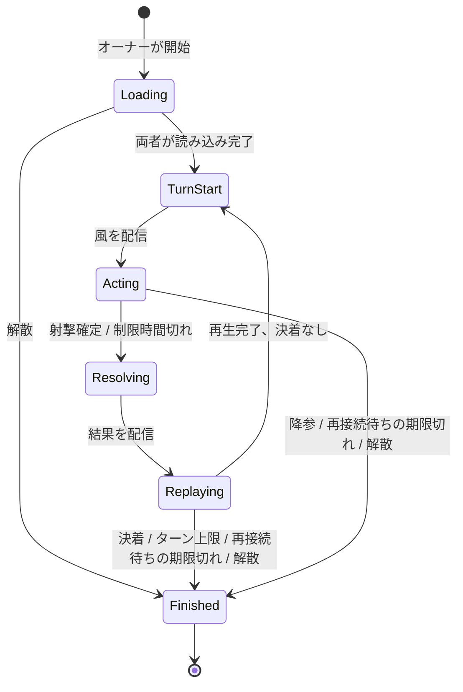

# 4. ターン状態遷移

この章では、対戦が始まってから終わるまでの状態と、状態を動かす出来事を定める。
対戦の外側にある部屋の状態（募集中、対戦中、リザルト）は [ロビーと部屋](./09-lobby.md) が持ち、この章の状態はその「対戦中」の中身にあたる。
状態はサーバーが持ち、クライアントはサーバーの通知に従って表示を切り替える。
クライアントが勝手に状態を進めることはない。

## 4.1 対戦の状態

各状態の意味は次のとおりである。

- **Loading**：オーナーが開始した。マップとスポーンを配信し、両者の読み込み完了を待つ。部屋の ready フラグと区別するため、この名前にする。
- **TurnStart**：手番側を決め、風を抽選する。クライアントは残り歩数を全回復する（歩数はサーバーの状態には持たず、射撃確定時に検証する）。
- **Acting**：手番側が移動と角度調整を行い、射撃を確定するまでの状態。制限時間が動く。
- **Resolving**：サーバーが射撃を検証し、弾道、着弾、地形破壊、ダメージ、落下、勝敗を計算する。
- **Replaying**：両クライアントが結果を再生している。サーバーは再生完了の報告を待つ。
- **Finished**：決着。結果を配信し、部屋はリザルト状態に移る。

## 4.2 Acting の中身

Acting の間、手番側からは次の入力を受け付ける。

- 移動（1 歩ずつクライアントで判定し、サーバーには最終位置だけを送る）
- 仰角の変更と向きの変更（クライアントで保持し、射撃確定時に送る）
- 射撃確定（向き、仰角、パワー、移動後の x をまとめて送る）

サーバーは Acting の間、手番側の途中経過を受け取らない。
射撃確定のメッセージ 1 つですべてを受け取り、検証する。
したがって、撃たずにターンが終わった場合、サーバーは移動を知らず、機体はターン開始時の位置のままになる。
クライアントは `turn.pass` を受けたら、表示上の位置をターン開始時に戻す。
相手側のクライアントには、手番側の移動と仰角が見えない。
ポトリスでは相手の動きが見えたが、途中経過を送らない設計を優先し、見せる場合は後で足す（TBD-7）。

制限時間の 20 秒はサーバーで計測する。
サーバーの時計が期限を過ぎた時点で射撃確定が届いていなければ、パスとして Resolving に進む。
期限の直前に送られた射撃確定が回線の遅れで期限後に届いた場合、サーバーは 1 秒の猶予を見て受け付ける。
猶予を超えたものは破棄し、パスの結果が優先される。

## 4.3 Resolving の検証

サーバーは射撃確定を受け取ると、次を順に検査する。
どれかに失敗した場合、その射撃確定を無効としてパスにする。
不正な値を補正して受け付けることはしない。
補正すると、クライアントの表示と結果が食い違うためである。

1. 送信者が手番側である。
2. 状態が Acting である。
3. 向きが左か右で、仰角が 10 から 90 の整数である。
4. パワーが 0 から 100 の整数である。
5. 移動後の x が、移動前の x から歩数の上限（1 ターンの歩数 × 1 セル。1.9 の表で定める）以内である。
6. 移動前の x から移動後の x まで 1 歩ずつ勾配判定を再実行し、すべての歩が許容される。

6 の判定は、クライアントが使った同じ関数をサーバーで実行する。
これが移動における唯一の不正対策で、最初の版ではこれで足りる。

## 4.4 Replaying の完了

再生完了は両クライアントが報告する。
パスのターンには再生するものがないので、Replaying は即座に完了し、報告を待たない。
片方の報告が一定時間届かない場合、サーバーは待たずに次のターンへ進む。
再生の長さはショットによって変わるが、上限を設けて対戦の進行を止めない。

| 項目 | 初期値 |
|---|---|
| 再生完了を待つ上限 | 10 秒 |

上限を超えたクライアントは、次の TurnStart の通知を受けた時点で再生を打ち切り、確定状態に表示を合わせる。

## 4.5 切断と再接続

切断は制限時間切れとは別に扱う。
制限時間切れは「操作しなかった」ことの結果であり、切断は「操作できなかった」ことの結果だからである。

クライアントの接続が切れたら、サーバーは席を一定時間保持し、同じ接続トークンでの再接続を待つ。
再接続できた場合、サーバーは現在の対戦状態をすべて送り直し、クライアントはそこから表示を再構築する。
弾道は再計算方式なので、途中の Replaying に復帰する場合も、結果メッセージを送り直せば同じ再生ができる。

| 項目 | 初期値 |
|---|---|
| 再接続を待つ時間 | 60 秒 |

再接続を待つ間の扱いは、切れた側が手番かどうかで分ける。

- 手番側が切れた場合：制限時間を一時停止する。再接続したら残り時間から再開する。
- 相手側が切れた場合：手番側はそのまま行動でき、Resolving まで進める。Replaying は相手の再生完了を待たない。

再接続を待つ時間を超えたら、切れた側の負けとして Finished に進む。
対戦相手には「相手の再接続を待っています」と残り時間を表示する。

## 4.6 対戦中の解散

オーナーが対戦中に部屋を解散した場合、対戦は決着理由「解散」で Finished に進む。
勝者はなく、リザルトも表示せず、全員をロビーに戻す。

## 4.7 降参

Acting の間、どちらの側も降参できる。
降参はその場で Finished に進み、降参した側の負けになる。
誤操作を防ぐため、確認を 1 回挟む。

## 4.8 Finished の後

結果を両者に配信し、部屋は [ロビーと部屋](./09-lobby.md) のリザルト状態に移る。
再戦は同じ部屋に戻って行う。
対戦ログは保存しない（永続化を持たないため）。
