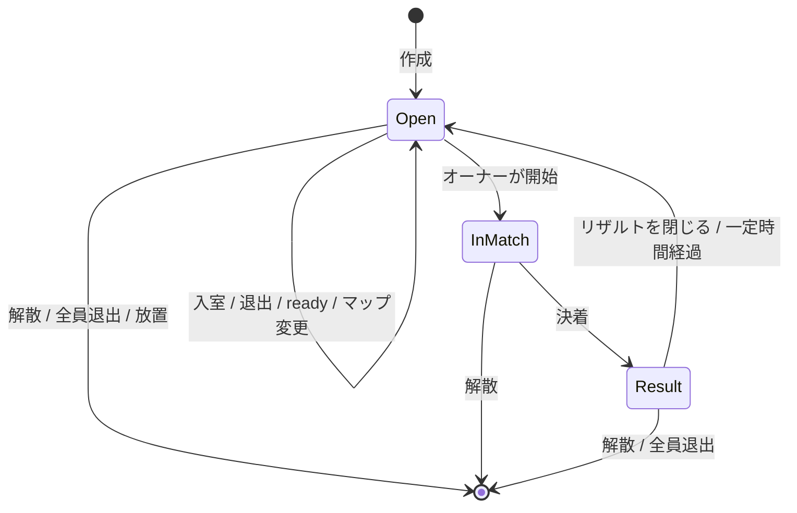

# 9. ロビーと部屋

この章では、ゲームを開いてから対戦が始まるまでと、対戦が終わってから次の対戦までの流れを定める。
対戦そのものの状態は [ターン状態遷移](./04-turn-state-machine.md) が持ち、この章はその外側を扱う。

## 9.1 全体の流れ

1. ゲームを開く。
2. プレイヤー名と戦車の色（主色と副色）を設定する。プレビューで確認する。
3. ロビー（部屋の一覧）に入る。
4. 部屋を作るか、一覧から募集中の部屋に入る。対戦中の部屋には観戦者として入れる。招待リンクやコードから直接入ることもできる。
5. 部屋の中で人数が揃い、オーナー以外が全員 ready になったら、オーナーが対戦を開始する。
6. 対戦が終わるとリザルトを表示する。
7. 同じ部屋に戻って再戦するか、退出する。

## 9.2 プレイヤーの識別と設定

アカウントは持たない。
その代わり、初回起動時に端末ごとの匿名 ID を発行し、プレイヤー名と色と一緒に端末に保存する。
将来アカウントやランクを導入するとき、この ID に記録を紐づけられるようにするためである。
ID を持たずに始めると、導入時に全員の記録が初期化される。

プレイヤー名と色は、ロビーと部屋の中ではいつでも変えられる。
対戦中は固定する。
弾や HP バーの色が途中で変わると相手が混乱し、記録の整合も崩れるためである。

| 項目 | 初期値 |
|---|---|
| プレイヤー名 | 1 文字以上 12 文字以下。空白のみは不可。文字種の制限は TBD-15 |
| 同じ部屋でのプレイヤー名の重複 | 許す。色で区別する |
| 色 | 主色と副色を [グラフィックの方向性](./08-visual-direction.md) の 7 色から選ぶ。同じ色でもよい |
| プレビュー | 選んだ色で塗った戦車をその場に表示する |

将来の機体選択は、この設定画面に項目を足す形で入れる。

## 9.3 部屋の一覧

ロビーは公開部屋の一覧を表示する。
部屋は多数になる前提で、一覧はページに分け、表示名で検索できるようにする。

一覧に出す情報は次の 5 つに絞る。

- 部屋の表示名
- マップ名
- 人数（現在 / 上限）
- 観戦者数
- 状態（募集中、対戦中）

| 項目 | 初期値 |
|---|---|
| 1 ページの件数 | 20 |
| 並び順 | 募集中を先に、次に対戦中。同じ状態の中では作成が新しい順 |
| 検索 | 表示名の部分一致。大文字小文字を区別しない |
| 絞り込み | 状態（すべて、募集中のみ、対戦中のみ）、マップ |

一覧の更新は、サーバーが「変化があった」ことだけを通知し、クライアントが表示中のページを取り直す方式にする。
ページと検索条件を持つ一覧に差分を適用するのは、並び順の変化や件数のずれで崩れやすいためである。
通知は数秒に 1 回まで間引き、部屋の増減が激しいときに取り直しが連続しないようにする。

対戦中の部屋には観戦者として入れる。
一覧の行に「観戦」の操作を置く。

## 9.3.1 観戦

観戦者は対戦中の部屋に入り、両プレイヤーと同じ再生を見る。
操作はできず、部屋の中の参加者にもならない。
観戦者の入退室は対戦に影響しない。

- 観戦者は入室時に現在の対戦状態を受け取り、以降は参加者と同じ `turn.start` と `turn.result` を受け取る。
- 手番側の移動と仰角の途中経過は、参加者と同じく見えない（TBD-17）。
- 観戦者にはプレイヤー名だけを持たせ、色は持たない。
- 対戦が終わったら観戦者にもリザルトを見せる。その後は部屋の募集中の状態を見続けられ、席が空けば参加者として入れる。
- 観戦者数には上限を置く。

| 項目 | 初期値 |
|---|---|
| 観戦者の上限 | 8 人 |

将来のスコアやランクに観戦は影響しない。

## 9.4 部屋の作成

部屋を作るときに決めるのは次の項目である。

| 項目 | 内容 |
|---|---|
| 表示名 | 一覧に出す名前。省略すると「〈プレイヤー名〉の部屋」。文字種の制限は TBD-15 |
| 公開か非公開か | 既定は公開。非公開は一覧に出ず、コードかリンクでだけ入れる |
| マップ | 3 枚から選ぶ。部屋の中で変えられる |
| 人数の上限 | 最初の版では 2 で固定。将来のために設定として持つ |

入室コードは常にサーバーが自動生成し、プレイヤーが決めることはできない。
自分で決めたコードは推測されやすく、非公開のつもりの部屋に知らない人が入ってくるためである。
表示名とコードを分けることで、「名前は好きに付ける、入口は推測できない」を両立する。

| 項目 | 初期値 |
|---|---|
| コードの形式 | 英大文字と数字 6 文字。読み違えやすい文字（O、0、I、1）を除く |
| 招待リンク | コードを含む URL。開くと設定画面を経て直接その部屋に入る |

## 9.5 部屋の中

部屋には 1 人のオーナーと、その他の参加者がいる。
作った人が最初のオーナーになる。

部屋の中でできることは次のとおりである。

- 参加者：ready の切り替え、プレイヤー名と色の変更、退出
- 観戦者：退出、席が空いていれば参加者への切り替え
- オーナー：マップの変更、参加者の退室（キック）、対戦の開始、部屋の解散

主色は部屋の中で衝突しないようにする。
入室時に先にいる参加者と同じ主色だった場合、入室は許し、入った側に別の主色を選ぶよう求める。
衝突している間、その参加者は ready にできない。
先にいた側を優先するので、入室によって既存の参加者の色が変わることはない。
副色は相手と同じでもよい。

ready の規則は次のとおりである。

- オーナーは ready を持たない。開始の操作が ready の代わりになる。
- 開始の条件は、人数が上限に達していて、オーナー以外が全員 ready であること。
- 参加者が入室か退出したとき、オーナーがマップを変えたとき、参加者が主色を変えたときは、全員の ready を解除する。観戦者の入退室と副色の変更では解除しない。条件が変わった状態で古い ready が残るのを防ぐためである。

オーナーが退出した場合、入室が最も早い参加者にオーナーを移す。
移す先がいなければ部屋を消す。

人がいない部屋はすぐに消す。
募集中のまま誰も操作しない部屋は、一定時間で消す。

| 項目 | 初期値 |
|---|---|
| 放置された部屋を消すまでの時間 | 30 分 |

## 9.6 対戦の開始と終了

オーナーが開始すると、部屋は対戦中になり、[ターン状態遷移](./04-turn-state-machine.md) の Loading 状態に入る。
対戦中は参加者としての入室を受け付けない。観戦者としての入室は受け付ける。

対戦が終わると、全員にリザルトを表示する。
リザルトには現在の対戦状態から計算できる項目だけを載せる。

- 勝者と決着の理由（HP、リングアウト、ターン上限、降参、切断）
- 経過ターン数
- 各プレイヤーの与えたダメージと直撃数

スコア、Ace、ランクなどは対戦結果の永続化とアカウントが前提になるので、最初の版では載せない。
画面の枠だけを先に用意し、項目は後で足す。

## 9.7 再戦と退出

再戦は「同じ部屋に戻る」と定義する。
リザルトを閉じると部屋は募集中の状態に戻り、全員の ready が解除される。
オーナーはマップを変えてもよく、そのまま開始してもよい。
再戦のための特別な状態は持たない。

退出は誰でもいつでもできる。
解散はオーナーだけができ、部屋にいる全員をロビーに戻して部屋を消す。

対戦中に退出した場合は、[ターン状態遷移](./04-turn-state-machine.md) の切断と同じ扱いにし、再接続を待った後に負けとする。

## 9.8 部屋の状態遷移

- **Open**：募集中。一覧に出る（公開の場合）。
- **InMatch**：対戦中。中身は [ターン状態遷移](./04-turn-state-machine.md) の Loading から Finished まで。オーナーが解散すると対戦は決着理由「解散」で終わり、リザルトを経ずに部屋が消える。
- **Result**：リザルト表示中。全員が閉じるか、一定時間で Open に戻る（TBD-16。初期案は 60 秒）。
