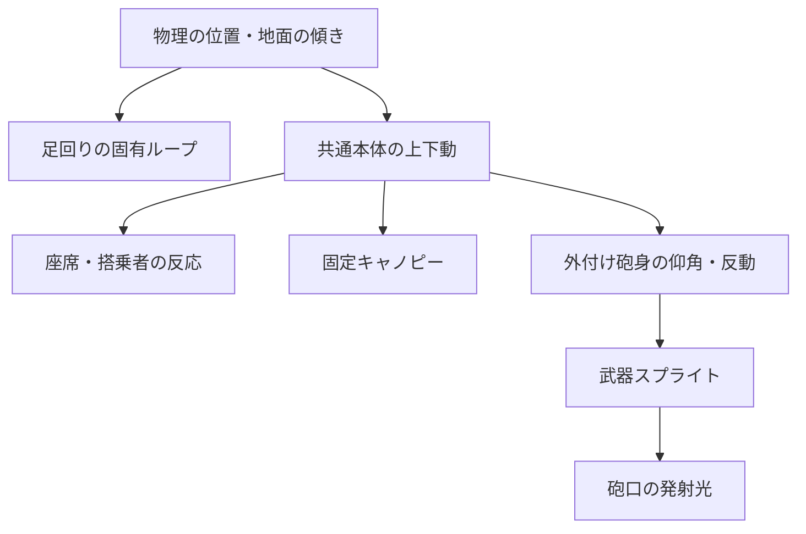

# 11. モジュール式スプライトとモーション

> 2026-09-09: 新デザインの正本・色・パーツ構造・制作寸法は [16. 新デザインの制作基準](16-production-baseline-v2.md) を優先する。実装用素材は baseline-v2。旧案は履歴として区別し、新規生成の参照にしない。

## 11.1 方針と実装状況

2026-09-09 更新。自分のキャラクターがマシンに乗り込んで戦う 2D ドット絵のゲームにする。
本体は搭乗者が見える共通キャノピーとし、マシンの形状を変えるのは足回りと武器のみ。タレットシェルを選ぶ旧案は取り下げる。
キャラクターとカスタマイズの方針は [キャラクターと搭乗マシン](./12-pilot-and-machine.md) に定める。
基準アセットを制作し、独立したガレージ動作試験台で合成と再生を確認する段階に進んだ。
ゲームへの組み込みは未実装。
最新の形状は [新デザイン](../../assets/concepts/original-v1/03-direction-refined.png)、実装用素材は [baseline-v2](../../assets/workbench/baseline-v2/README.md)。旧機体・旧モーション画像は履歴としてのみ保持し、再生成の参照にしない。

制作形式と検証は [14 章](./14-asset-pipeline.md) に統一する。
8 章の配色と 12 章の形状を基準にし、物理セルと原画のドットを分離する。
武器の弾道・威力・地形破壊・機体の当たり判定は既存の sim を基準にする。
足回りとキャラクターのカスタマイズは、設計上は見た目だけとして扱う。性能差は導入しない前提の案であり、追加する場合はゲームルールとして別途決定する。

## 11.2 パーツ構成

完成機体の組み合わせごとの画像は作らず、以下を重ねて構成する。

| パーツ | 役割 | 差し替え単位 |
|---|---|---|
| 足回り / undercarriage | 履帯などの駆動部、サスペンション、排気位置 | 将来 undercarriageId で選択。駆動部のフレームも足回りに属する |
| 共通本体 / cabin | 台座、座席、キャノピー、外付け武器の接続部 | 全足回りで同一。選択用 ID は設けない |
| 搭乗者 / pilot | 提供キャラクターの素体、表情、独立したメガネ・スカーフ | マシンと別の外見データ。スキン・ペイント方式は 12 章の未決定事項 |
| 武器 / weapon | 砲身、発光部、砲口 | 既存 WeaponId。選択中の 1 個を表示 |
| 共通 VFX | 排気、発射光、火花、着弾、煙、破片 | 機体の部品に焼き込まず別素材 |

足回りと共通本体を分け、駆動部を接地させたまま本体を沈ませられるようにする。
キャノピーは車体の傾きに追従し、砲身だけが外付け接続部を中心に仰角で回る。
重なり順は、背面 VFX → 足回り → 本体背面と座席 → 搭乗者 → 車体の前面 → 半透明ガラスと反射 → キャノピー前面の枠 → 外付け武器 → 前面 VFX とする。
武器の前後関係は、全角度で顔の保護領域を避けた素材で成立させる。接続カバーが反動中の根元を覆う。
ガラスには半透明の色面と光沢を使い、搭乗者が内部にいることを示す。目を不透明な反射で覆わない。
HP と名前はこの上下動・反動の外に置く。

## 11.3 制作サイズと接続の契約

制作フレームは192×160 art px、12 art px/cell。ground [96,144]、weaponPivot [96,96]、muzzle [144,96]とし、物理の4セルの高さ・砲身長を維持する。実画面の表示倍率と物理の当たり判定は別に検証する。
キャノピー内のキャラクターが単なる点になる場合は不合格とし、原画の解像度だけを増やして解決したことにしない。
小画面では陰影を省いた縮小用フレームを用意するか、ゲーム画面の表示倍率を別途見直す。物理サイズを絵に合わせて変更しない。

各パーツのフレームは透明背景、共通の原点、右向きで制作する。
マシンは完全な側面図で統一し、奥側の足回りや車体上面が見える斜め視点を混在させない。キャノピー・足回り・武器は同じ投影で制作する。
余白込みのキャンバスサイズは全角度・全反動で欠けないよう、基準機体で確定する。
最初は atlas の trim と packing rotation を無効にし、フレームごとの位置ずれを防ぐ。

| 接続点 | 契約 |
|---|---|
| ground | 車体下端中央。物理位置に固定し、待機・反動で動かさない |
| cabinMount | 足回りに定義する共通本体の取付点。全足回りで地面からの高さと本体位置を揃える |
| pilotSeat | 共通本体の搭乗者原点。体のスキンや姿勢が変わっても座席からずれない |
| faceSafeArea | 顔の判読を保つ共通領域。枠・反射・武器・装飾・継続する煙で覆わない |
| weaponPivot | 共通本体の外付け砲身回転軸。静止時は ground から上に BARREL_BASE_UP = 4 セル |
| muzzle | 武器に定義する発射光の原点。静止時は pivot から砲身方向に BARREL_LENGTH = 4 セル |
| exhaust | 足回りごとの排気点。煙の発生元 |
| damageSmoke | 共通本体後部の損傷煙の発生元。顔を避ける |

接続点の座標は trim 前の art px、フレーム時間は ms、描画から物理への換算は共通倍率で記録する。
足回りの形を変える場合も接地・本体取付点・占有範囲を揃える。共通本体・キャノピーは変形や拡縮をせず、そのまま載せる。
武器は砲口までの有効長を揃え、太さ・カバー・突起の輪郭で種類を表す。
描かれた銃身が長いから弾の出発点が遠くなる、という変更は行わない。
左向きはパーツと接続点を同じ座標変換で反転する。角度の二重反転に注意する。
拡大は nearest-neighbor、ピクセル素材にぼかしを掛けない。砲身の角度を粗い方向数に丸めて照準とずらさない。

武器が変わってもキャノピー自体は維持する。接続カバーは武器側の部品として扱う。
砲口付近の装飾や砲身の回転がキャノピーや顔に干渉しない範囲を、全 8 武器・左右・全仰角で確認する。
固定された物理の pivot と顔の保護領域が両立する配置を、標準砲の試作時点で検証する。成立しない場合はキャビンの画面上の配置を再設計し、黙って発射位置を変更しない。

## 11.4 色替え

マシンの primary / secondary は維持する案とし、キャラクターの見た目とは独立して扱う。
共通キャノピーの形・枠・ガラスは固定。キャラクターのスキンやペイント方式は未決定のため、マシンの 2 色に割り当てない。

| 色の役割 | 使用箇所 |
|---|---|
| primary の明・中・暗 | 台座と足回りの外装。主色を読める面積に残す |
| secondary の明・中・暗 | 武器カバー |
| 固定色 | 輪郭、駆動部の金属、黒い開口部、共通キャノピーの枠と反射 |
| pilot 専用 palette / mask | キャラクターの体と外見。マシンの色替えから独立 |
| VFX の色 | 弾・尾・爆風の識別部分は発射者の primary。煙は共通の灰色 |

画像全体の tint ではなく、役割付きの palette index を置換する。
透明 index と固定色を含む共通 palette を使い、編集用原画も palette の役割を保持する。
候補の 7 色ごとに 3 段階の色を定義し、主色と副色が同じでも輪郭・金属・明度差で部品を区別する。
生成画像の近似色を実行時に探して置換する方式は使わない。
各色の組み合わせは選択時にフレームを生成・キャッシュし、毎フレームのピクセル走査は行わない。
新デザインのサフランイエローやクリーム、VFXの炎色は標準配色であり、現在の選択色や所有者の識別色を置き換える決定ではない。

## 11.5 機体モーション一覧

以下の数値は制作初期値。frame は描き下ろし枚数、key はパーツの位置などの姿勢キーを表す。
画像を機体全体で毎コマ描き直さず、各パーツと共通 VFX の組み合わせで動かす。

| 状態 | 制作目安 | 動きと終了条件 |
|---|---|---|
| 待機 idle | 4 key / 1,200 ms loop | 足回りは静止。本体が最大 1 art px 上下。搭乗者はゆっくり瞬き。小さい排気を間欠的に出す |
| 移動 move | 足回り 4 frame、本体 4 key | 固有の駆動ループを移動距離に同期し、逆走では逆再生。本体の沈みと後方の少量の土煙。停止・壁では駆動も停止 |
| 発射 fire | 4 key / 180 ms、発射光 3 frame / 90 ms | 発射時に砲口が静止基準位置に合い、その直後に砲身を最大 2 art px 引く。外装を 1 art px 沈めて復帰 |
| 被弾 hit | 3 key / 120–400 ms、火花 4 frame | 実ダメージに応じた白フラッシュと短い振動。物理の位置は変えず元の姿勢へ戻す |
| 低 HP 待機 critical idle | 4 key / 1,600 ms、煙 6 frame / 900 ms | 不規則な振動、煙と火花。搭乗者は不安な目・煙へ視線・肩をすくめる反応。主色と輪郭を残す |
| 落下 fall / 着地 land | 落下は基準姿勢、着地 3 key / 180 ms | 落下中は履帯・接地煙を止める。実際の着地で外装だけ沈める |
| 大破 destroy | 6 key / 600 ms、爆発 6 frame | HP が正から 0 以下になった時点で一度だけ開始。足回りと武器の故障に合わせ、搭乗者は驚く→目を閉じて頭をかばう→様子を見る |
| 残骸 wreck | 足回りごとに 1 frame、共通本体 1 frame、搭乗者の落胆 key | 停止したマシンと少量の煙。搭乗者は肩と頭を落とし、ため息の後に落胆姿勢を維持。物理障害物や追加ダメージを発生させない |

低 HP は 0 < HP <= 最大 HP の 25% を仮の境界とする。
リプレイ中は最終 HP を先取りせず、表示中の着弾までに確定した HP で状態を選ぶ。
煙は低 HP の移動・発射中も継続し、critical idle の振動だけを通常待機と置き換える。
狙いを調整している間は待機の上下動を止め、砲身と角度表示を安定させる。
連射の各発射時刻で発射光と反動を再トリガーするが、反動の変位は加算せず上限内で復帰させる。
発射イベントの瞬間は表示 pivot / muzzle を基準位置に合わせ、弾の初期位置と連続させる。

状態を 1 個の巨大な animation 名にせず、移動姿勢（待機・移動・落下）、短い反応（発射・被弾・着地）、損傷状態（通常・低 HP・大破）を組み合わせる。
反応が重なる場合は被弾 > 発射の車体反動 > 着地の順。発射光と弾は車体反応とは独立して必ず表示する。
大破はすべての機体モーションに優先し、追加被弾で最初から再生しない。
搭乗者も大破の驚きから残骸の落胆へ移る。低 HP の不安は発射・被弾時の短い反応後に復帰し、大破後の残骸から通常待機へは復帰しない。
奈落は画面外へ落ちて退場する演出とし、地上に残骸を出さない。
大破演出の途中で結果画面や次の状態に移る場合、状態遷移を止めず、その画面の破棄と一緒に演出を終了する。

## 11.6 砲弾と武器別 VFX

| 武器 | 飛行中の素材 | 発射光 | 着弾の特徴 |
|---|---|---|---|
| cannon / 標準砲 | 短い砲弾 1 frame、点状の尾 | 小さい十字 3 frame | 丸い膨張、破れた輪、煙 6 frame |
| triple / トリプル弾 | 小型砲弾 1 frame × 3 発 | 各発射で小さい光 | 標準爆発を各着弾半径に合わせて使用 |
| multiple / マルチ弾 | 小さい粒 1 frame × 9 発 | 各発射で短い光 | 小爆発 4 frame。尾と破片を控えめにする |
| drill / 貫通弾 | 縞が回る弾頭 2 frame | 押し出す形の光 3 frame | 貫通段ごとの火花と破片 4 frame。3 段を一つにまとめない |
| laser / レーザー弾 | 細長い光弾 2 frame、細い尾 | 小さい電気の光 3 frame | 各段に小さい光輪 4 frame。7 段と実際の飛行を維持する |
| digger / 掘削弾 | 太い砲弾 1 frame | 幅広い光 3 frame | 広い土砂と煙 6 frame。ダメージより地形破壊を表す |
| floater / 浮遊弾 | 明暗が巡る球体 4 frame | 丸いパルス 3 frame | 外へ開く輪 6 frame。浮遊感は絵だけで、弾道に揺れを足さない |
| stinger / 針弾 | 細長い針 1 frame、尾なし | 細い閃光 2 frame | 小さい鋭い火花 4 frame。狭い爆風を巨大な炎にしない |

レーザーも現在は重力と風を受ける弾であり、瞬時に命中する beam に見せない。
トリプルは 3 発、マルチは 3 本 × 3 回 = 9 発。各発射時刻は既存 replay の launchAt に合わせる。
砲弾の中心と向きは既存の弾道列から取り、見た目の animation で位置や命中時刻を変えない。
尾・破片・煙は機体の名前、HP、次の弾を長く覆わない密度にする。

着弾は既存 hitFeedback の 590 ms に合わせ、以下の節目を保つ。

| 着弾からの時刻 | 表現 |
|---|---|
| 0–70 ms | 接触の小さい光。既存の着弾停止 |
| 70–190 ms | 爆風の膨張 |
| 190 ms | 地形削除・表示 HP 更新・被弾反応の開始 |
| 190–490 ms | 最大範囲の火花や明暗、破片 |
| 490–590 ms | 輪が崩れ、煙が消える |

VFX の frame 数に合わせてこれらの節目を遅らせず、各区間に絵を割り当てる。
爆風本体の最大範囲は各着弾段の blastRadius に合わせる。外へ飛ぶ少量の煙や破片はダメージ範囲とは区別できる形にする。
大破の爆発は機体の装飾演出であり、通常の着弾イベントや地形破壊を再発生させない。

## 11.7 保存データと将来の追加

初回は足回り 1 種・固定キャノピー・搭乗者 1 種を既定素材として組み、選択 UI や通信フィールドはまだ追加しない。
描画素材は undercarriage / cabin / pilot / weapon / effects の単位で管理する。
本体はキャノピー・台座・座席を含めて固定。キャラクター種・足回り・武器を追加しても同じ本体素材を使う。
キャラクターは speciesId ごとの素体・表情・搭乗姿勢・装備接続点を参照し、カエル固有の形を共通処理へ埋め込まない。
足回りは接続点と固有の駆動 loop、武器は接続点と砲弾・発射光・着弾 VFX のセットを定義して追加する。描画側で候補数を固定しない。
新しい武器の追加には sim・protocol・バランスの対応も必要であり、画像だけで新武器が完成するわけではない。
各定義には id、atlas の frame、接続点、palette の役割、clip ごとの frame と durationMs を持たせる。
同じ共通モーションが部品の接続点を動かし、足回り固有の駆動ループや残骸だけ各素材に持たせる。キャラクターの表情・姿勢は搭乗者側の素材で共通イベントに反応する。

複数の外装を導入する段階で machineAppearance に undercarriageId、独立した pilotAppearance にキャラクターの外見を持たせ、既存の colors と loadout はそのまま使う。
turretShellId / canopyId は選択項目にしない。pilotAppearance はメガネとスカーフを独立した任意の装備 ID として扱う。スキン・ペイント部分の具体的な項目は方式の決定後に定義する。
保存・room profile・参加者表示・対戦スナップショット・再接続で同じ appearance を使い、古い保存データは既定パーツへ移行する。
サーバーは公開済み ID を検証し、クライアントが知らない ID は既定素材で表示する。
外装 ID を sim のダメージ・衝突計算へ渡さない。将来パーツが増えても全組み合わせのアニメ画像は作らない。

自分の選択武器は即座に見た目へ反映する。
相手の射撃前のスロット選択は現行プロトコルでは同期されないため、最後に確定した武器（開始時は slot 0）を表示し、射撃データ受信時に確定武器へ切り替える。
相手の手元の選択まで即時に見せる変更は、別の通信仕様として扱う。

## 11.8 制作順と受け入れ条件

1. 足回り 1 種・共通キャノピー・搭乗者・標準砲を試作し、対戦の最小表示サイズで顔と色を確認してから透過・indexed palette・同一原点の素材へ仕上げる。
2. 待機・移動・発射・被弾・低 HP・落下と着地・大破を標準砲で組み、パーツの位置ずれと重複イベントを確認する。
3. 標準砲の砲弾・爆発を実際の着弾 timeline で確認し、残り 7 武器と固有 VFX を追加する。
4. 設定画面と対戦に共通の素材・姿勢計算を使い、全色・全武器・左右・坂道・仰角の上下限を確認する。
5. 別形状の足回りと別配色のキャラクターを検証用に差し替え、キャノピーを変えず、共通モーション処理を書き換えずに成立することを確認する。

検証項目：

- 全 49 通りの主色・副色で固定色が保たれ、同色同士でも輪郭と部品を読める。
- 足回りを替えてもキャノピーの寸法・形・座席位置が同じで、搭乗者の顔と外見を判読できる。
- マシンの色替えが搭乗者やガラスを染めず、搭乗者の外見を替えても武器や当たり判定に影響しない。
- メガネとスカーフの 4 通りの装備状態で素体が成立し、左右・前後・搭乗姿勢・反動時も接続がずれない。
- 待機・移動・被弾をしても ground が動かず、照準と弾の初期位置は物理と一致する。
- 連射・多段着弾で弾や VFX が欠けず、反動が積み上がらず、大破は 1 回だけ起きる。
- 無傷の近傍爆発では被弾反応を出さず、低 HP の閾値前後と HP 0 で正しい状態になる。
- 壁で移動が止まった時、落下中、着地、奈落、再接続、画面の破棄でループや煙が残らない。
- 設定プレビューと対戦で形・色・部品の重なりが一致し、PC とモバイルで判読できる。
- 接続点・frame 時間・状態選択は実装時に単体テストし、既存 golden replay で物理結果が変わらないことを確認する。

基準 pack の透過素材、palette、9 状態の animation と合成ツールを制作した。
目視での仕上げ、武器固有 VFX、ゲーム内の動作確認は引き続き上記の制作工程で行う。
