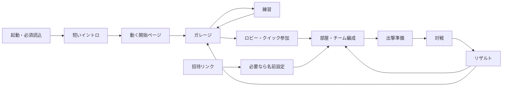

# 20. 世界公開に向けた2Dゲーム再設計

2026-09-09 / 設計提案 / 実装・性能検証・本番反映は未実施。

## サービス名

2026-09-09、ユーザー決定により正式名称を **KEROPOD**、日本語の読みを **ケロポッド** とする。
「ケロ（カエル）」と「pod（小型の乗り物・搭乗空間）」を組み合わせ、カエルとキャノピー付きの小さなマシンを結び付ける。
ロゴ・画面タイトル・紹介文ではKEROPODに統一する。過去の参照画像や資料の固有タイトルは、素材を特定できるよう元の表記を保持する。
名称決定と商標・既存サービス・ドメインの利用可否確認は別であり、後者は未実施。

## 20.1 結論と設計の優先順位

KEROPODを「URLを開けば、自分の小さなマシンで世界の人と一発を競えるゲーム」にする。
ブラウザを主要な提供先とし、TypeScript / React / PixiJSを継続する。ゲームエンジンの全面移行は現段階では推奨しない。
一方、2人固定モデル、全マップを収める表示、全ルームを集めたサーバー構成は置き換える。

優先する体験は、(1)一発の読み合い、(2)搭乗者とマシンへの愛着、(3)友人を誘いやすい入口、(4)多人数でも状況が分かること。
カメラや開始演出は、この四つを支える。世界公開を理由にショップ、ランキング、複雑な育成を先行させない。

| 項目 | ユーザー要件 | 本設計の推奨 |
|---|---|---|
| カメラ | 固定感のある機体サイズ、可変マップ、スワイプ、マウス端スクロール | 倍率固定の通常視点、手動パン、自機・弾追従、ミニマップ |
| 相手の移動 | 移動中にリアルタイム表示 | serverで歩行を逐次確定、他clientは補間表示。角度・powerは別扱い |
| マップ | おおむね2.5画面分 | 基準端末のゲーム表示領域を基準にし、全端末で2.5画面にはしない |
| 対戦 | 2〜8人、任意のチーム分割 | 2〜8チーム、各1〜7人、非対称編成もカスタム戦で正式対応 |
| UI | タンクのデザイン方向性を踏襲 | 深い青の操作盤、クリームのメニュー、サフランの主要操作 |
| 開始ページ | ワクワクするアニメーション | 短い導入→動くタイトル→ガレージ。再訪や招待は短縮 |
| シーン | 全遷移に演出 | 共通遷移管理と場面別の短い演出。通信完了と表示演出を分離 |
| 世界公開 | 世界の人がアクセスし遊べる | CDN配信、部屋ごとのサーバー、言語対応、再接続、運用と段階公開 |

「固定サイズ」は、同じ端末ではマップや人数が変わっても倍率を変えない、という意味で設計する。
「ポトリス参考」はユーザーが示した端スクロールと砲撃ゲームの見回し体験を基準にする。特定バージョンのフレーム単位の挙動を再現したとは扱わない。
ポトリス固有の画像・UI・音・名称は流用せず、既存のKEROPODの方向性で制作する。

## 20.2 設計の正本と旧仕様の扱い

今回の新しい実装目標は20〜23章。従来の0〜19章は、変更対象外の仕様と現行実装の参照として残す。
衝突した場合、カメラ・多人数ルール・開始導線・通信構成は20〜23章を優先する。
アートは16〜19章、特に19章の「完成した外見単位で制作」を維持する。
以下はユーザー要件に基づく設計変更であり、旧契約を維持するという記述の対象外とする。

| 旧仕様 | 新しい実装目標 | 詳細 |
|---|---|---|
| 1対1、Seat=0/1、2要素tuple | PlayerIdとTeamId、可変人数 | 22章 |
| 400×225固定、全体フィット | MapSpecに寸法、独立カメラ | 21章 |
| スワイプで移動・照準 | ワールド上のスワイプはカメラ専用 | 21章 |
| 主色の重複でready不可 | 塗装は重複可、チーム印と番号で識別 | 22章 |
| 個人勝利・切断時全体待機 | チーム勝利・個人再接続猶予 | 22章 |
| 全部屋を単一Hubに収容 | Room Objectと分割Directory | 23章 |
| 設定から開始、固定左右ペイン | タイトル、ガレージ、上下HUD | 21章 |
| ランダムマッチングは対象外 | 世界公開に向けた対称編成のクイック参加 | 23章 |

既存8武器の特徴と決定論的な地形破壊は引き継ぐ。威力・射程は新マップで検証してから変更する。
既存8マップは旧寸法の互換fixtureとして維持し、8人対応済みとは表示しない。

## 20.3 一回の体験

初回は「風を読む→角度→長押し発射」の3操作を練習で短く案内する。練習を強制しない。
タイトルの主ボタンは「はじめる」。ガレージでは「すぐ対戦」「友だちと遊ぶ」「練習」を区別する。
ログインはゲストの最初の一戦の必須条件にしない。外見所有の復元など、必要な時にアカウントへ結び付ける。

招待リンクではイントロを省略し、必要なプロフィール入力の後、対象部屋へ進む。
満員・開始済み・期限切れなら理由と観戦／ロビーへの出口を出す。勝手に別部屋へ参加させない。
再接続中はタイトルへ戻さず対戦復帰を優先する。

## 20.4 先に解くリスク

| リスク | 設計上の対処 | 実証すること |
|---|---|---|
| マップを広げると弾が届かない | カメラ導入と物理寸法拡張を別工程にする | 風・地形別の到達可能性 |
| 8人で自分の番が来ない | 20秒の手番、次手番表示、固定再生期限 | 待ち時間と離脱率 |
| 1対2で公平性が曖昧 | 全員1行動/round、人数差を明示 | 不利を隠さず楽しめるか |
| 機体を大きくすると見渡せない | 全体把握はミニマップ、手動パン | 小画面の照準・人物判読 |
| 演出中に時間が減る | 演出枠をサーバー時刻へ組み込む | 遅い端末で操作時間が失われないか |
| 世界公開でHubが詰まる | 1部屋1Object、一覧は別集約 | 部屋間の負荷隔離 |
| 素材の読み込みが重い | タイトルと対戦を段階読込 | モバイル初回アクセス |

## 20.5 実装順序と完了条件

順序は、表示だけ先に作って後から多人数対応を押し込む形にしない。
各工程は最新のcodex/2d-updateから独立した作業ブランチを切り、baseも総合ブランチにする。

| 工程 | 成果物 | 次へ進む条件 |
|---|---|---|
| A: 体験の試作 | 実アセット1機、旧マップ、カメラ、上下HUDの操作可能な試作 | 844×390とPCで顔・照準・パン・発射を実機確認 |
| B: ルール基盤 | 可変PlayerId/TeamId、round、脱落、勝利、MapSpec、protocol v2 | 全編成・同時撃破・再接続の自動テスト、旧1対1fixtureの意図した差分確認 |
| C: 対戦の縦断実装 | 8人入室→準備→対戦→結果→再戦 | 独立8クライアントで1試合完走、重複入力で二重発射しない |
| D: 世界公開基盤 | Room Object、Directory、version固定、メトリクス | 再起動復元、複数部屋の分離、目標負荷試験 |
| E: 体験の完成 | タイトル、導線、全シーン遷移、音、一般用アバター | スキップ・低速回線・音声拒否・招待・復帰を確認 |
| F: 招待alpha | 1対1、2対2、FFA、1対2、2対2対2、4対4 | 待ち時間・照準・公平感を観察し数値を確定 |
| G: 公開beta | 多地域導線、クイック参加、日英、通報、運用 | 23章の公開条件を達成。公開操作は別の明示指示 |

Aで機体サイズが成立しなければ、素材の対戦用縮小版を作る。物理判定を絵に合わせて無断で拡大しない。
Bで旧武器の意味を維持できなければ、マップ寸法と射程をまとめて比較する。
Dの負荷試験が未達なら、公開規模を制限して原因を解消する。単にエンジンを移して解決したことにはしない。

## 20.6 調整項目と判断方法

以下は承認済みの最終値ではなく、試作で比較する初期案。
仕様上の必須条件と、チューニングする値を分ける。

| 識別子 | 初期案 | 判断方法 |
|---|---|---|
| R-01 機体倍率 | 6 CSS px/cell、狭い横画面は4.5 | 実アセットの顔・砲口、3画面サイズで目視 |
| R-02 マップ | 基準可視幅200セルに対し500セル | 8武器の到達性と8人配置を探索 |
| R-03 手番 | 操作20秒、導入0.6秒、再生通常3〜6秒 | 8人で次手番までのp95と離脱理由 |
| R-04 試合上限 | 12 round / 20分 | 決着率、時間切れ率、脱落者の待ち時間 |
| R-05 カメラ | 端幅24px、最大480px/s、復帰300ms | 誤パン、酔い、目標を探す時間 |
| R-06 非対称戦 | 初期補正なし、friendly fireあり | 1対2・1対7の納得感。補正導入は別ruleSet |
| R-07 一般用アバター | 新規の配布可能な外見1種 | 本人専用素材を初期値に混ぜない |
| R-08 容量と費用 | 23章の段階的予算 | 実測課金とピーク試験で公開上限を決める |

最初にレビューしたいのは「固定サイズの見え方」「全員1行動の手番方式」「20秒の操作時間」。
本設計では上記の推奨で一貫して定義し、回答待ちの空欄にしていない。
