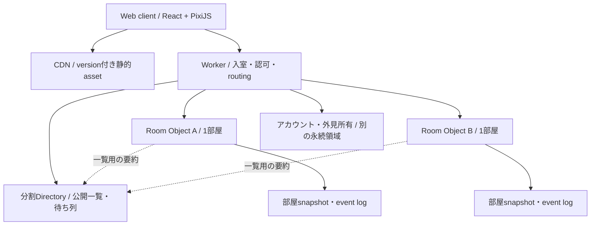

# 23. 技術選定・通信・世界公開の構成

2026-09-09 / 設計提案。外部仕様は末尾の公式資料を同日に確認。性能値は目標であり計測結果ではない。

## 23.1 フレームワークの再評価

判断の優先順位は、リンクからの参加、モバイルの起動と操作、決定論の共有、制作効率、運用の順。
ゲームエンジンの種類と、8人の状態を同期できるかは別の問題。

| 候補 | このゲームで活きる点 | このゲームで負担となる点 | 判断 |
|---|---|---|---|
| React + PixiJS + Vite | 現在のTS物理・protocolを共有、DOMのメニュー、描画の自由度 | camera・scene・素材管理はアプリ側で設計する | 推奨継続 |
| Phaser + TypeScript | camera・scene・inputなどゲーム向け機能が揃う | 既存rendererとReactの責任境界を移し替える必要 | 制作速度がボトルネックなら比較試作 |
| Godot | ゲーム向けeditorとscene、native出力を統合できる | TS物理の共有方法を再設計、Web exportの性能・配信条件を検証する必要 | native主軸に変わったときの有力候補 |
| Unity | editor・animation・native向けの制作環境 | 現在の資産・protocolとの統合や移植が必要 | 現要件では移行負担に見合う根拠なし |

Phaserの物理は必要時に有効にする仕組みであり、「物理が必ず二重になる」は不採用理由にしない。
公式資料上、GodotのWeb出力はmobileで利用できるが制約があり、thread利用には配信条件がある。
UnityもWebの対応端末をversionごとに確認する必要があり、「mobile Webで絶対に使えない」とは扱わない。
これらの資料は可能性を示すもので、本ゲームの起動速度やFPSを保証しない。
[Phaser Physics](https://docs.phaser.io/phaser/concepts/physics)、[Godot Web export](https://docs.godotengine.org/en/4.5/tutorials/export/exporting_for_web.html)、[Unity 6 Web compatibility](https://docs.unity3d.com/6000.0/Documentation/Manual/webgl-browsercompatibility.html)。

PixiJSのContainerによる座標変換をworld rootに用い、HUDはReactに残す。
scene切替は小さいアプリ用Coordinatorで実現し、Reactの再renderで毎フレームの弾や機体を更新しない。
[PixiJS Container](https://pixijs.com/8.x/guides/components/scene-objects/container)。

移行の再検討条件は、(1)最適化後も対象実機で30fps未達、(2)素材制作とscene編集の手作業が継続的に支配的、(3)native/consoleが主要提供先になること。
条件に達したら同一マップ・8機・同じVFX・同じnetwork replayで比較する。主観的な「本格的だから」で全面移行しない。
現時点ではエンジン間の実機benchmarkをしていないため、性能優位は断定しない。
Next.jsは対戦クライアントに導入しない。検索流入用の紹介サイトが必要ならゲームruntimeとは別に扱う。

## 23.2 現行コードで確認した変更境界

| 確認したファイル | 現在の前提 | 必要な変更 |
|---|---|---|
| packages/protocol/src/match.ts | Seat=0/1、damageとhpが2要素 | PlayerIdと可変人数、team結果 |
| packages/protocol/src/room.ts | MatchState.playersが2人tuple | 可変人数とTeam、round、MapSpec |
| packages/engine/src/turn.ts | otherSeat、2人HP比較、全員replay待ち | turnRing、team生存、時刻による再生進行 |
| packages/engine/src/engine.ts | 接続・切断状態も2人固定 | 個人猶予と脱落、全体は進行 |
| packages/protocol/src/constants.ts | MAP_WIDTH=400、MAP_HEIGHT=225 | version付きMapSpecから渡す |
| apps/client/src/game/scale.ts | パネルを引いた範囲に全mapフィット | viewportとcamera倍率の分離 |
| apps/client/src/ui/useSwipeAim.ts | swipeで移動と角度 | world panに置き換え、照準は専用領域 |
| apps/client/src/match/reduce.ts | 2人view、射撃時の状態更新 | movement eventとseq同期 |
| apps/server/src/persist.ts | 復元も2要素 | version付き可変stateの復元 |
| apps/server/src/cf/worker.ts | 単一Hubに全室、命令ごと全体を保存 | Room単位の永続化とrouting |

この表は設計のための主要経路確認であり、全リポジトリの監査結果ではない。
sim、maps、engine、protocolを純粋ロジックとして維持し、移行時に全call siteとtestsを列挙して更新する。

## 23.3 推奨サーバー構成

1つのRoom Objectが、部屋の準備・対戦・リザルト・再戦までを所有する。部屋と試合を別Objectに分けて二重の正本を作らない。
Room内のstate更新は順序を一意に決める。外部通信を挟んで部分更新状態を公開しない。
Directoryは一覧用の要約で、席や勝敗の正本ではない。一覧が古くてもRoomで入室条件を再検証する。

CloudflareはDOを単一の場所にある調整単位として説明し、ゲームsessionごとの分割に適している。
locationHintは配置の希望であって保証ではない。CDNが世界配信されても、一室の対戦処理が全地域で同時実行されるわけではない。
[Rules of Durable Objects](https://developers.cloudflare.com/durable-objects/best-practices/rules-of-durable-objects/)、[Data location](https://developers.cloudflare.com/durable-objects/reference/data-location/)。

地域は初期APAC / Europe / Americasの希望区分とし、実際のroom RTTを入室前に測る。
自動選択は本人の低いRTTを基準にし、招待は部屋の配置を優先する。地域名だけで低遅延と表示しない。
異地域の友人同士も入れるが、300msを超えるRTTは目安を表示する。実測前の地域別SLOは約束しない。

Directoryはregion×mode×固定shardへ分割可能なキーを持ち、初期は各組1shardから開始する。
一覧はpaginationし、毎フレームや全接続への全室broadcastを行わない。
Roomは参加者数・phase変更時だけrevision付き要約を更新し、TTLで残った古い部屋を除去する。
Directory更新失敗は再試行可能なoutboxへ積み、試合を止めない。
roomIdを含む招待tokenを使えば、Directoryが停止しても既存の招待と再接続を維持できる。

## 23.4 リアルタイム通信と権威

WebSocketをRoomへ接続し、clientは移動入力と発射要求を送る。serverが位置・予算・ダメージ・勝敗を確定する。
カメラ、画質、音量、未確定の角度・powerは通信不要。移動は[22章](22-multiplayer-rules.md)の10Hz以下のコマンドを使う。

共通envelopeはprotocolVersion、matchId、turnId、commandId。順序が必要な入力にはmoveSeqを加える。
server eventにはeventSeqとserverTimeを持たせ、同じ結果の再配信と順序抜けの検出に使う。
Zodで構造と値を検証した後、membership、手番、deadline、状態、頻度を検証する。型検証だけで権限を満たしたとしない。

| メッセージ | 方向 | 用途 |
|---|---|---|
| session.hello / accepted | 双方向 | protocol・sim・asset version確認 |
| room.assignTeam / ready / start | client→server | revision付き準備操作 |
| move.command | client→server | 有限step要求、seqとcommandId |
| player.moved | server→全員 | 確定位置と移動残量、ack |
| turn.fire | client→server | 最終moveSeq、角度、向き、power、武器slot |
| turn.result | server→全員 | 確定射撃結果、terrain変更、再生時刻 |
| state.snapshot | server→client | 新規観戦・復帰・hash不一致から復元 |
| state.resync | client→server | 最後のeventSeqとstate hash |

WebSocketの同一接続内の順序を利用するが、再接続をまたいだ重複はcommandIdで除去する。
古い接続はsession generationで無効化し、2タブから同じPlayerIdを同時操作させない。
受理記録とstateを永続化してから成功eventを送る。結果送信の途中で切断してもsnapshotとeventSeqで回復できるようにする。
移動eventは最新位置へ合流可能だが、shot結果・脱落・手番開始は落とせない重要eventとして扱う。
送信bufferが詰まったclientは細かい移動更新を間引いてsnapshotへ切替し、メモリを無制限に積まない。

乱数はserverが生成し、将来の風や抽選seedをclientへ先に渡さない。結果に必要な確定値だけ送る。
物理は両側で同一versionの固定小数点simulationを使うが、clientの算出結果は正本にしない。
移動予測のhashと確定stateのhashを混ぜず、確定event境界でのみ照合する。

## 23.5 永続化・alarm・復旧

Roomのstate、eventSeq、command重複記録、期限を一つの整合した更新として保存する。
Roomごとのsnapshotと短いevent logを使い、毎移動で全世界の状態や地形全体を書かない。
地形はcheckpoint maskと、その後のTerrainOp列で復元する。checkpoint間隔は復元時間と保存費用を測って決める。
移動更新の書込量も課金・CPUの測定対象であり、Hibernationを使えば無料になるとは考えない。

WebSocket Hibernationと接続attachmentに最小のsession識別を使う。起動時に永続stateから復元する。
1Objectにつきalarmは1個なので、手番・再生・再接続・部屋TTLの最小期限を登録し、発火時に期限済み処理を順に実行する。
alarmは重複・遅延を想定し、turnIdと処理済み状態で冪等にする。alarmが遅れても古いmove/fireをdeadline後に受理しない。
Hibernation用の扱いは[公式WebSockets資料](https://developers.cloudflare.com/durable-objects/best-practices/websockets/)を基準に実装する。

稼働中の復元で乱数を再抽選しない。確定済みの風・手番ring・射撃結果は保存値を使う。
state schema不一致・復元失敗は旧stateを上書きせず、部屋を復旧不能として閉じ、結果を無効試合として記録する。
クライアントは理由を表示しロビーへ戻せる。架空の勝敗を作らない。

## 23.6 Versionと移行

protocolVersion、simVersion、mapVersion、ruleSetVersion、assetManifestVersionを試合開始時に固定する。
clientとserverのprotocolが合わなければ開始前に更新案内し、進行中の部屋で混在させない。
単なるasset更新でも既存matchが使うmanifestを削除しない。HTMLは更新確認し、hash付きassetは長期cacheする。

v1の既存Hubとv2のRoom namespaceを並行稼働させ、新規v2部屋だけ新構成へ送る。
v1部屋は自然終了させ、途中試合を新stateへ変換しない。v1へ戻す場合もv2試合は終了までv2 handlerへ残す。
ロールバックでversion不一致の部屋を別のsimで再開しない。
service worker/PWAは更新整合の検証後に導入し、初期公開の条件にはしない。

## 23.7 世界公開に必要な入口と運用

初期公開はゲスト対戦と任意ログイン。ゲストにもserver発行の匿名sessionを持たせ、nicknameを本人識別子にしない。
招待用コードは参加の入口であり、オーナー権限や再接続の証明ではない。
短いコードの総当たりは回数制限し、深いリンクは十分なentropyと期限を持つtokenを使う。

無料一般アバターを最低1種用意し、本人専用外見は認証済みのgrantでのみ選択できるようにする。
外見の使用可否はserverで確認する。購入は初期公開から切り離し、導入時に所有・返金・復元を設計する。

UI文字列はID化し、日本語と英語を公開初期の対象とする。ブラウザ言語を初期値にし、手動変更を保持する。
表示名のUnicode・長い文字列・翻訳による伸び・時刻表記を確認し、文字を画像へ焼き込まない。
チャットは初期は定型文とpingを推奨し、spam制限、mute、通報を設ける。自由文の世界公開は運用体制を整えてから。
ユーザー名・部屋名も通報対象とし、運営が部屋やsessionを調べられるmatchIdを表示する。

クイック参加は地域希望・modeで待ち列を分ける。過疎時に知らない編成へ勝手に変更しない。
待ち時間30秒で別地域や練習の選択肢を表示し、キャンセルできるようにする。BOTで人数を偽装しない。
アカウントと十分な母数が揃うまではskill rankを導入せず、公開部屋と招待で遊べる状態を優先する。

メトリクスは起動成功、初回一戦到達、入室失敗、RTT、移動補正、desync、試合完走、手番待ち、脱落後離脱、費用/試合。
logはmatchId / roomId / eventSeq / error codeを中心にし、接続tokenや不要な個人情報を記録しない。
初期の保持案は診断event7日、集計30日。公開前に保管目的、削除方法、利用規約・privacy表示を確定する。
公開説明で法的適合を保証したとは扱わず、運営者・対象地域・対象年齢に応じた確認を別途行う。

## 23.8 性能・費用の予算

以下は実測前の公開gate候補。代表実機の型番・OS・browser versionを試験記録へ固定する。

| 指標 | 初期目標 | 測り方 |
|---|---|---|
| 初期タイトル必須転送 | 圧縮後2MB以下 | cold cache、videoを除外 |
| 最初の対戦までの必須転送 | 累計8MB以下 | 使用マップと8機の共通atlasのみ |
| はじめる操作可能 | 10Mbps / RTT150msでp95 3秒以内 | cold cache、20回以上 |
| 戦場描画 | 対象mobileで通常60fps、負荷時p95 frame 33ms以内 | 8機・全武器・最大破壊・10分、温度も記録 |
| camera操作反映 | ローカルp95 50ms以内 | 入力から描画まで |
| 相手移動表示 | RTT250msでp95 350ms以内 | server受理とobserver表示の時刻差を補正 |
| simとserver処理 | 最重shot p95 CPU 20ms以内を候補 | 8対象・最大steps・全武器、DO実環境 |
| 部屋復帰 | network回復からp95 3秒以内 | checkpoint＋event復元込み |
| 安定性 | 1時間soakでstate不一致0、二重発射0 | 8人×複数room、disconnect注入 |

GPU負荷はDPRを上限2に制限する案、背景・particleの削減、viewport外のculling、地形のdirty chunk更新で抑える。
画質を下げても機体位置、地形境界、弾道、入力速度は変えない。WebGLを基本とし、WebGPU必須にはしない。

移動broadcastの概算：1更新200byte、10Hz、8人へ送ると、移動中1部屋あたり約16KB/秒のpayload。
8観戦者を加えると約32KB/秒。transport overhead・shot・snapshot・storageは別途加算する。
最初の容量gateは100同時部屋（最大800参加者）、次が1,000同時部屋。いずれも予測でなく負荷試験で到達判定する。
全室の同時移動・長いshot・一斉再接続・Directory一覧更新を重ね、部屋分割だけで成功としない。

費用は `request + active duration + storage read/write + 保存量 + asset配信 + logs` を、実測利用量と最新単価で算出する。
公開時の金額上限は運営予算が未提示のため未確定。alphaで1試合・1CCU時間あたりの費用を出してから決める。
プラットフォームの上限と実効容量は異なる。[Cloudflare DO limits](https://developers.cloudflare.com/durable-objects/platform/limits/)をdeployment時にも再確認する。

## 23.9 公開gateと停止判断

- 機能：58編成の自動検査、代表8人E2E、可変map、カメラ、リアルタイム移動、再戦、観戦が通る。
- 整合：重複入力、古いturn、2タブ、再接続、Object再起動、version違いで不正な行動・勝敗がない。
- 実機：iOS Safari / Android Chrome / desktop Chrome・Safari・Firefox・Edgeで入室から結果まで確認。
- アクセシビリティ：reduced motion、mute、keyboard、色以外のチーム識別、拡大文字、focus、回転を確認。
- 運用：stageと本番を分離し、エラー追跡、通報導線、保存期限、rate limit、費用alarm、ロールバックを用意。
- リリース：招待alpha→地域を絞ったbeta→段階的世界公開。mainへの反映は別途明示指示で行う。

state不一致、二重発射、復元後の勝敗変化は新規部屋作成を止める重大不具合とする。
単なる高RTTは観測と案内を行い、全世界の試合を一括停止しない。
静的サイトの到達確認だけで世界公開完了とせず、複数地域から実際に対戦を完走して記録する。
