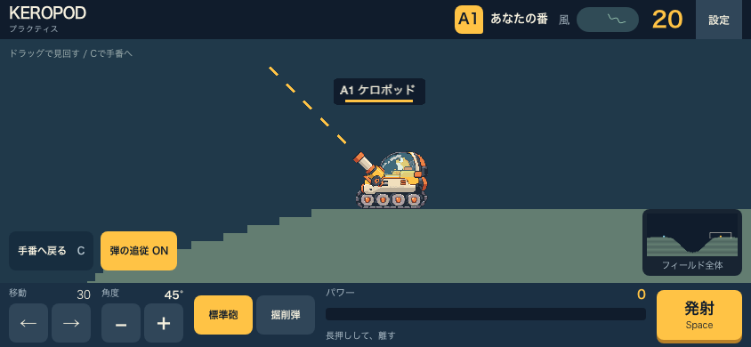
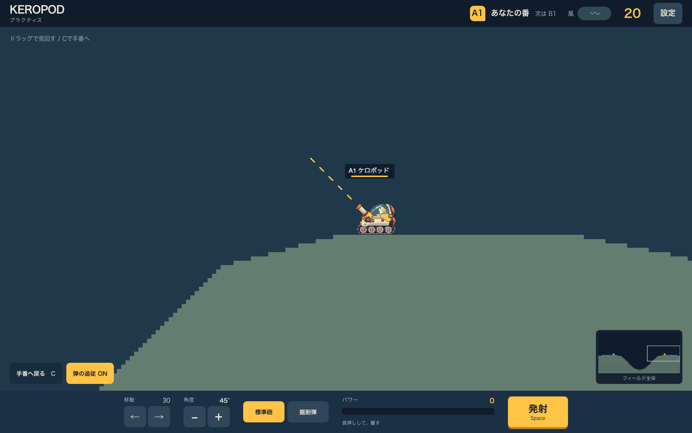

# 24. カメラとHUDの操作試作（工程A）

2026-09-09。ブランチ `codex/2d-camera-hud-prototype`。
工程Aの操作可能な試作。実機の操作感と最終アートの承認はまだ完了していない。

## 開き方

```sh
pnpm --filter @game/client dev --port 5184 --host 127.0.0.1
# http://127.0.0.1:5184/?prototype=camera
```

既存の谷マップ、1対1のローカルengine、射撃・地形破壊を使う。両方の席を交互に自分で操作できる。
通常の `/` では従来の設定画面と対戦UIが開く。
試作入口はViteのDEV分岐でのみ読み込み、本番ビルドには試作画面・PNGを含めない。

## 実装した範囲

- cameraのworld/screen変換、上下左右の境界、小さいmapの中央寄せ。
- ワールドのドラッグ／タッチスワイプはパン専用。機体移動や照準に転用しない。
- マウスの端24px、120msの待ち、最大480px/sの端スクロール。HUDへ出たら停止。
- 手番の機体への復帰、機体移動のdead zone追従、代表弾の追従とON/OFF。
- ミニマップによる全体把握・地点選択、Shift+矢印によるパン。
- baseline-v2の本体・履帯・搭乗者・8武器の実PNGをアンカーに合わせて表示。
- 上下HUD、移動と角度の専用ボタン、武器変更、横powerゲージ、発射、音設定。
- 一つのpointerが操作を所有し、取消・focus喪失・回転・設定表示ではpowerを破棄。
- 最小横画面の44px操作、縦持ちの回転案内、reduced motion。

## 今回の倍率比較

21章の初期案4.5/6 CSS px/cellでは、透明余白を除いた本体と搭乗者が小さかった。
試作では全端末 **9 CSS px/cell** に変更した。192×160の素材フレームは144×120 CSS pxになる。
表示だけの変更であり、判定半径・射程・移動量・マップ寸法は変更していない。
PC1440px幅では400cellの既存マップが2.5画面分。モバイルでは見える範囲が狭くなる。
機体名が上端に切れないよう、機体の接地点より6cell上を注視する。
この倍率は試作結果であり、対戦用アート寸法の最終承認ではない。

## 操作

| 操作 | 入力 |
|---|---|
| カメラ | ワールドをドラッグ／スワイプ、マウスを表示領域の端へ |
| キーボードでカメラ | Shift＋矢印 |
| 手番機体へ戻る | C、または「手番へ戻る」 |
| 機体移動 | A / D、または左右ボタン |
| 角度 | ↑ / ↓、または− / ＋ボタン |
| 発射 | Spaceまたは発射ボタンを長押しし、離す |
| 設定 | Escape、または設定ボタン |

Tabはフォーカス移動。ボタンにフォーカスした場合、Space/Enterでその操作を実行する。
練習の時計は従来engineのまま進行し、設定を開いても停止しない。

## 検証結果

- camera純関数と状態遷移：12件。座標往復、clamp、dead zone、端の待ち、FPS別復帰、manual上書き。
- ブラウザ：9件。パンと移動・照準の分離、端の停止、設定取消、移動→照準→発射→次手番、タッチ取消、回転、reduced motion、旧プラクティスの回帰。
- 667×375 / 844×390 / 1440×900の必須操作が44 CSS px以上で、画面内に収まることを確認。
- `pnpm test`：成功（素材86件＋workspace396件）。`assets:check`はproduction pack未完成の案内を出すが失敗ではない。
- `pnpm -r typecheck`、client production build：成功。buildには500kB超のchunk警告が残る。
- production出力に試作module・CSS・pilot PNGが含まれないことを確認。

Chromiumでのブラウザ検証とモバイル・touch emulationであり、iOS/Android実機の確認ではない。
FPS、発熱、顔の判読に関するユーザー評価、Safari/Firefoxの実動作は未検証。

## 比較画像

### モバイル横画面（844×390）



### PC（1440×900）



## 次工程へ残すこと

- 多人数モデル、チーム手番、相手のリアルタイム移動、protocol v2は工程B/C。
- 可変MapSpecと新しい500cellマップは未導入。現時点のworld boundsは既存maskから設定。
- 弾追従はindex 0の代表弾を使用。残弾への引継ぎ、画面外マーカー、主要着弾のholdは続くcamera完成工程で追加。
- 弾・爆発・地形の絵は現行rendererの表示を使用。一般アバター、原寸の顔・paint・全モーションの本体統合は別検証。
- 名前とA1/B1で識別し、機体paintは元PNGの色を使用。本人用の最終一体portraitを搭乗素材として再加工していない。
- 開始ページとscene演出、world server、実機の最終調整は工程D以降。
- 試作確認後に通常の対戦画面へ統合する。現時点で本番機能が更新されたとは扱わない。

## 2026-09-10：短いカメラ慣性

スワイプ解放と端スクロール帯から内側へ戻したときに、時定数80ms、最長約320msの減速を追加。
速度は480 CSS px/秒に制限し、最大の追加移動は約38px。指を80ms以上止めてから離した場合は流さない。
新しい操作・手番への復帰・画面境界・設定表示・focus喪失・回転では停止する。
HUDへポインタが出たときも即停止。reduced motionでは慣性なし。キーボードのパンは従来どおり。

## 2026-09-10：カメラ調整パラメータ

設定内の「カメラ調整」で、その場で操作感を調整できる。

| パラメータ | 範囲 | 初期値 |
|---|---|---|
| 移動速度 | 0.25〜3倍、0.05刻み | 1倍 |
| 慣性の長さ | 0〜1000ms、20ms刻み。0でOFF | 320ms |

移動速度はドラッグ・スワイプ・端スクロール・Shift＋矢印に反映する。
慣性はスワイプ解放と端スクロール終了時の減速時間を調整し、時定数は設定値の1/4。
上記の480px/秒・約38pxは初期値での値。自動追従・手番への復帰時間は変更しない。
変更時は進行中の慣性を停止する。reduced motionでは設定値によらず慣性を無効にする。
ブラウザのlocalStorageに保存し、再読み込みでも維持。「カメラを初期値に戻す」で両方を戻す。
保存できない環境でも、その場の調整は利用できる。

検証：client unit 155件、cameraブラウザ11件が成功。速度2倍での移動量、慣性OFF、
設定の再読み込み、モバイル横画面でのリセット操作を確認。client/e2e typecheckも成功。

## 2026-09-10：開始加速と手番移動のイージング

端スクロールは既存の120ms待機後、180msのsmoothstepで設定速度へ加速する。
加速途中で端から離れた場合は、その時点の速度を慣性へ引き継ぐ。
停止後の再操作や逆方向の端への移動では加速をやり直す。
ターン切り替えと「手番へ戻る」は300msのsmoothstepでイーズインアウトする。
ドラッグ・スワイプ中は指に直接追従し、キーボードのパンは従来どおり。
reduced motionでは開始加速を省略し、手番への移動も即時にする。

検証：client unit 157件とtypecheckが成功。開始加速、加速のリセット、
手番への移動の前後対称な加減速、30/60/120fpsでの到着を確認。
