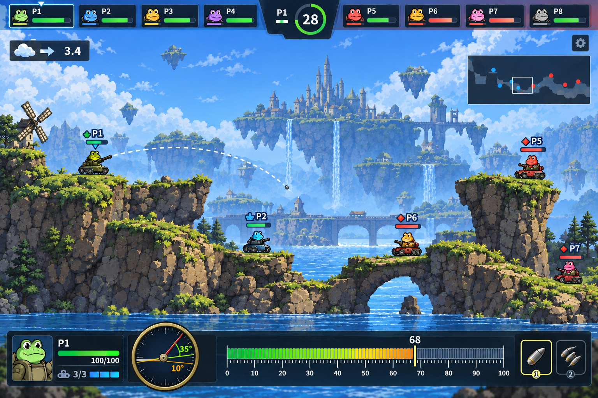
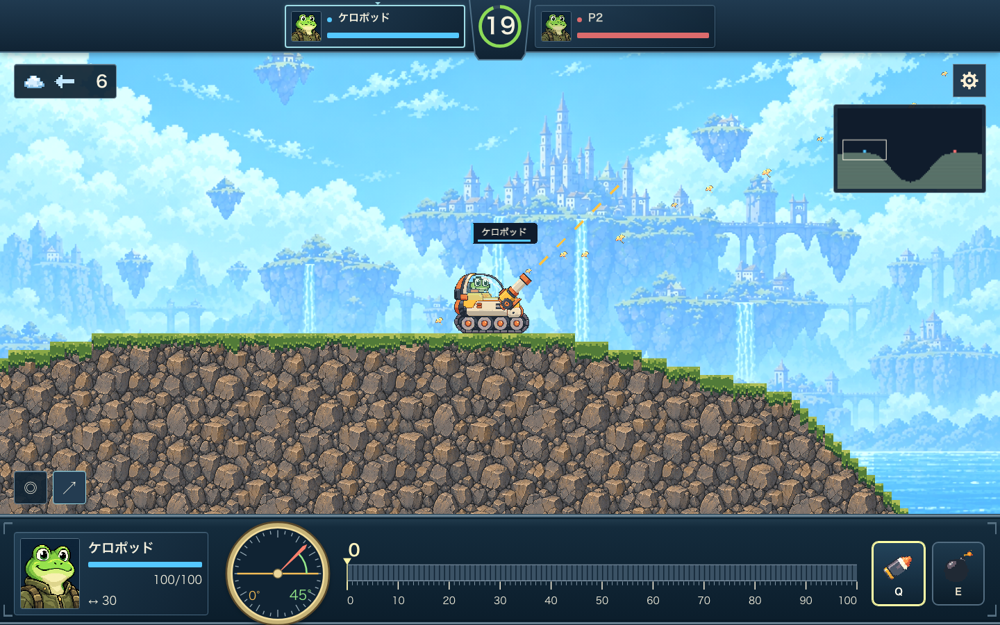
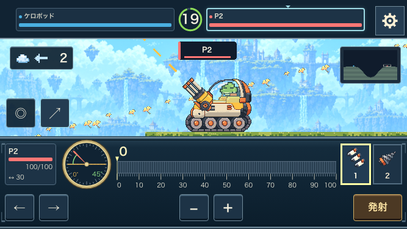

# KEROPOD UI 最終確認資料

対象: `55c8d86`。Chromium、ローカル開発画面5186、新規browser contextで取得。1440×900はdesktop、390×844と667×375はtouch入力を有効にしたエミュレーション。実機検証ではない。原案は承認された `desktop-refined-v4.png` を複製した。

## ゲーム画面の比較

| 原案 | 現在 |
| --- | --- |
|  |  |

- 原案の上部参加者・中央残り時間・風・右上minimap・下部操作盤という配置を反映。
- 円形角度計は地面と射角を別の色と数値で表示。長いパワー計は100分割、10ごとの強調、現在値の指針を持つ。
- 原案のチーム図形は、その後のユーザー指定に従い色へ変更。武器キーも最新指定のQ/E、touchは1/2。説明を増やして原案へ合わせることはしない。
- 岩の表示サイズを半分に調整。カメラ倍率・草・タンクの描画倍率・破壊maskは維持。
- 今回のゲーム画像は練習の2人構成。8人配置・結果画面の最新撮り直しはこの資料に含めていない。

### 見た目の判断が残る点

1. 岩の粒度と草の密度、明るい背景に対する戦場の読み取りやすさ。
2. HUDの詳細なカエル顔と、搭乗パイロットの小さな横向き表現のまとまり。
3. 最小横画面でのタンクの大きさと、戦場に割ける高さのバランス。
4. タイトル・ロビー・設定の共通パネル/ボタンの見た目の採用。

上記は採用判断の対象であり、機能テストが未実装という意味ではない。人間の最終承認を自動記録していない。

## タイトル・ロビー・設定

| 画面 | desktop | 縦向きtouch | 横向きtouch |
| --- | --- | --- | --- |
| タイトル | [1440](title-1440.png) | [390](title-390.png) | [667](title-667.png) |
| ロビー | [1440](lobby-1440.png) | [390](lobby-390.png) | [667](lobby-667.png) |
| 設定 | [1440](settings-1440.png) | [390](settings-390.png) | [667](settings-667.png) |

設定は練習を開く前に撮影し、CSSの初回読込修正後の状態を記録した。設定内容は内部スクロール、ロビーの主要操作は画面下に表示する。

## 検証と残件の境界

e530142の全体test/typecheckと配信90件は成功。その後の台座・初回設定・岩のサイズ変更には個別の検証記録がある。今回の撮影は総合テストの再実行ではない。

正式art packの登録は別工程。実機の描画/入力p95、実地域RTT、実DO容量・費用、8人の人間によるバランス評価、運営情報は [公開前の判断](../../../release-decisions-2026-09-10.md) を参照。本番公開・main統合は行っていない。
