# ドットテーマへの変更後

2026-09-13、51027e4のproduction build。WebKit、PC1440×900・タッチ模擬667×375。
通常入口からタイトル・ロビー・設定・対戦・リザルトを撮影したPNG原本。正式名称は未定で、ARTILLERYは仮表示。
実機スクリーンショットではない。旧グラフィック版の記録は別フォルダで保存している。

## PC

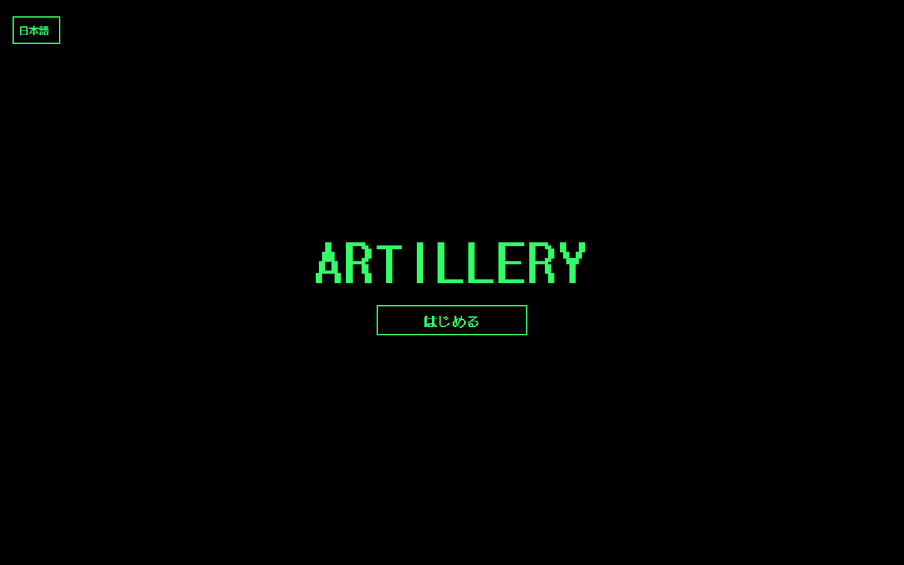
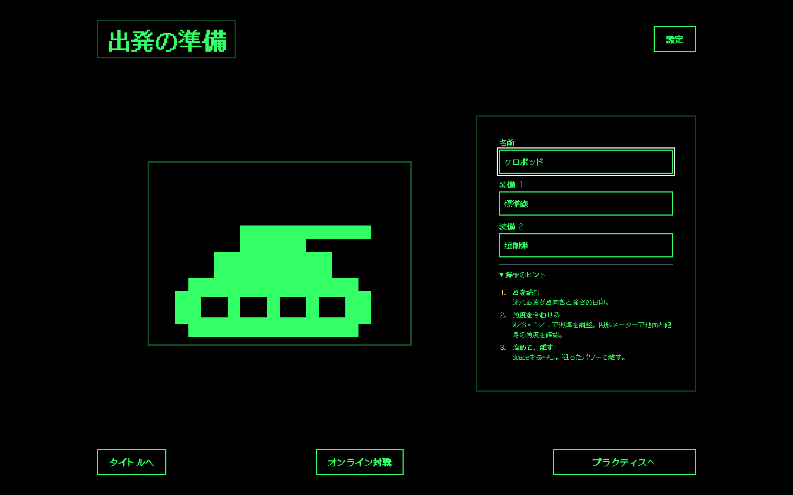
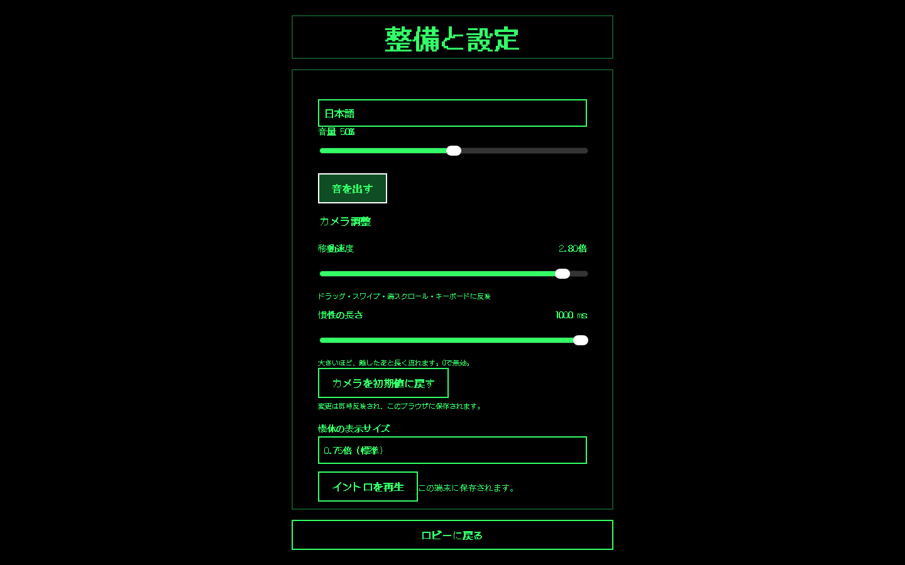
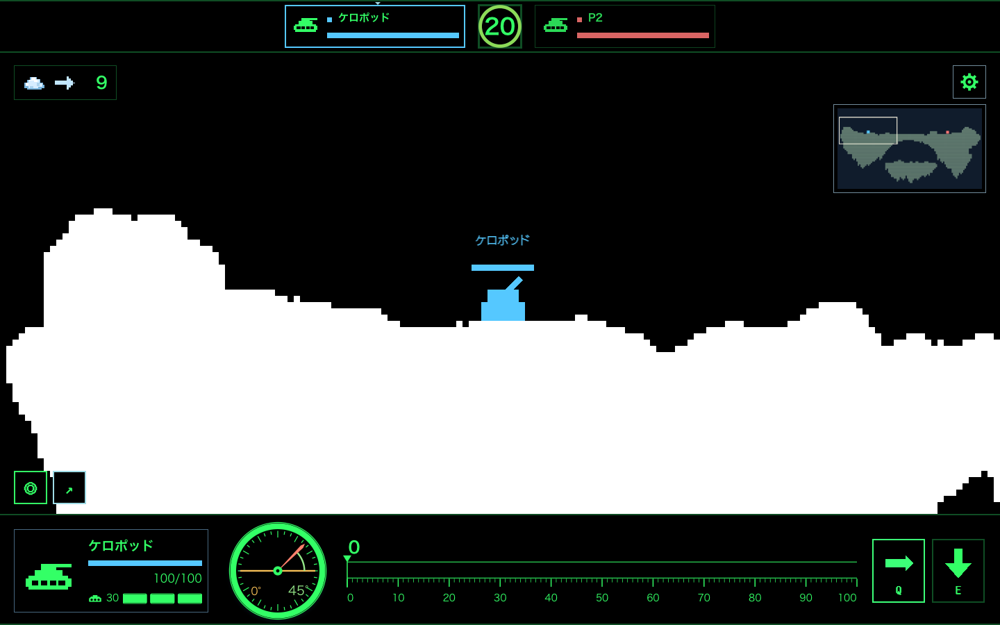
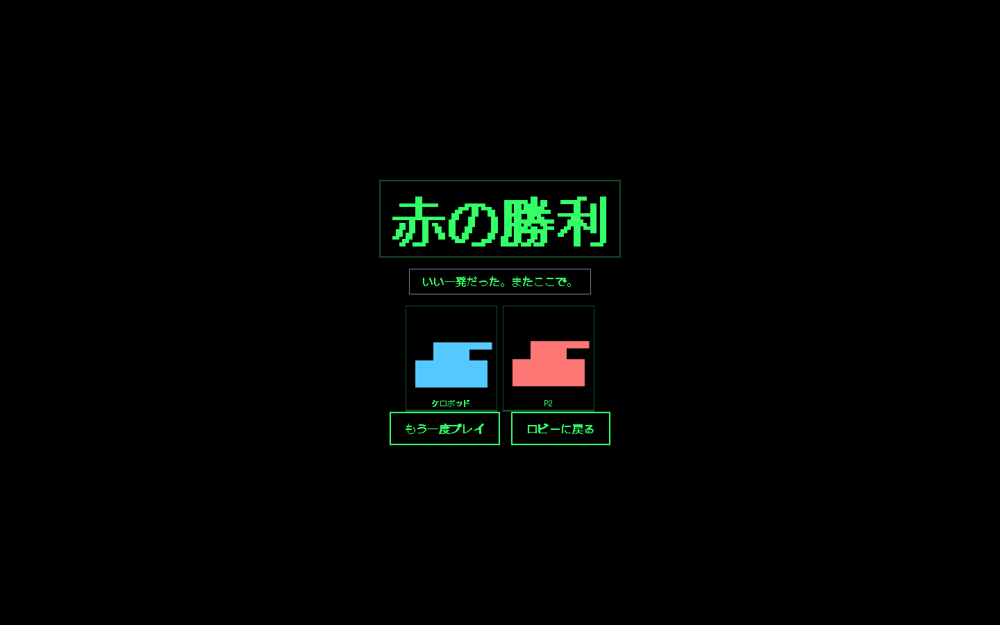

## タッチ端末の模擬表示

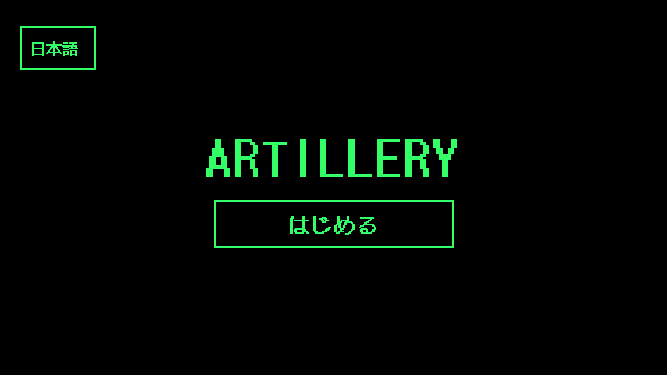
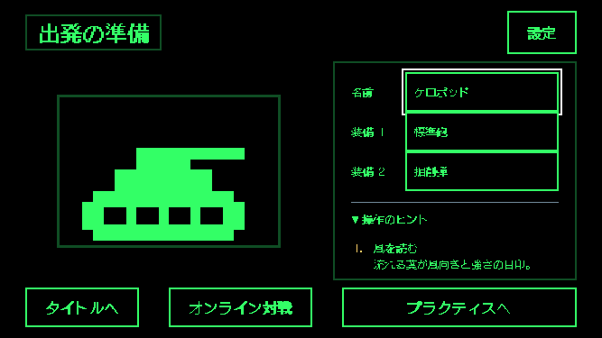
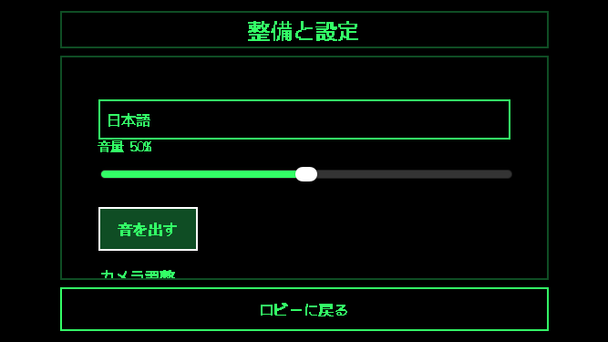
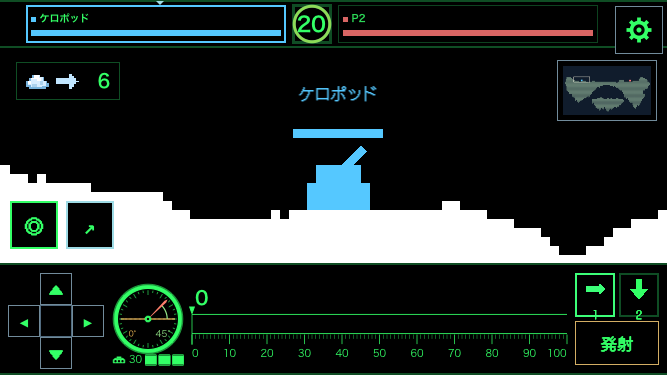
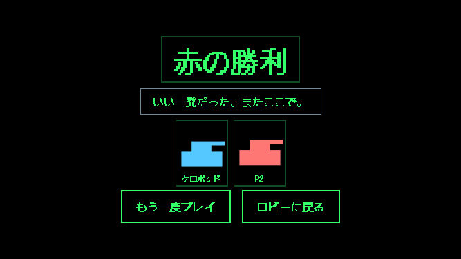

## 8人対戦（WebKit・ローカルWrangler）

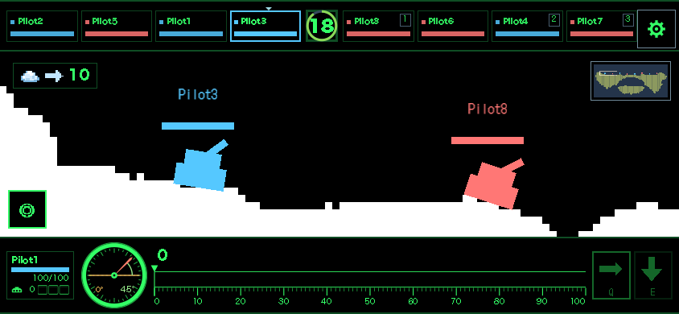
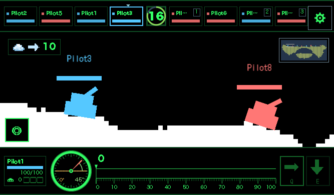
