# グラフィック版の制作記録 — 2026-09-13

## この記録の位置づけ

KEROPODという名称で制作したグラフィック版を、方針変更前の到達点として保存する。完成品・公開済みサービスという意味ではない。画面は設計モックではなく、この時点のコードをビルドして撮影したもの。

ユーザーは画像グラフィックとアニメーションが期待する品質に届かなかったと判断し、以前の黒と緑のドットテーマへ戻すことを決定した。今後はシンプルな描画でゲーム性を追求する。名称は変更予定（未定）、BGMと効果音も新しい世界観に合わせて再制作する。以下の名前・ロゴ・音源は旧版の制作履歴であり、継続採用の表明ではない。

## 発表で説明できる流れ

1. 固定画面の対戦から、可変マップ・カメラ・多人数対戦へ拡張した。
2. 生成画像の背景・破壊地形・機体・UI、音楽と効果音を組み合わせ、全シーンを実装した。
3. プレイテストで解像度、地形の縁、視認性、画面占有率、原案と実装の差を調整した。
4. グラフィックの作り込みを続ける方針を見直し、対戦機能と操作改善を引き継ぎながら、簡素なドット表現へ戻すと決めた。

この記録は実装によって得た成果と、採用を取り下げた表現を分けて示すためのもの。

## キャプチャの条件

- ソース: `38542ba88f07cbb751b0c04120f8293d13b3d432`、`codex/2d-world-ui`。
- 取得日: 2026-09-13。方針文書以外のアプリ変更なし。
- Vite production buildをローカル5188で起動し、Chromiumで撮影。
- Desktop: 1440×900。Mobile: 667×375、タッチ対応をブラウザで模擬。実機の撮影ではない。
- PNGは加工せず保存。ファイル別SHA-256は[captures.json](captures.json)に記録。
- キャプチャのゲーム画面はプラクティス。オンライン対戦の証拠とは区別する。

## 全シーン

### タイトル

Desktop

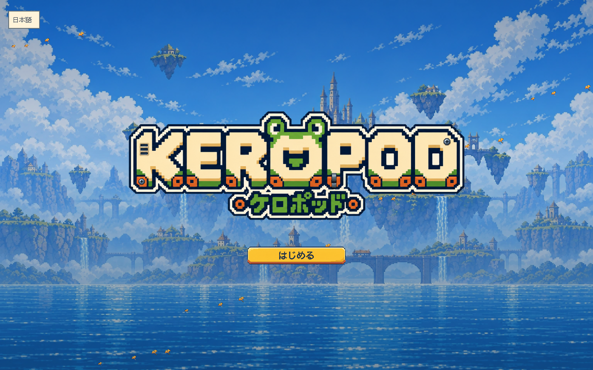

Mobile（ブラウザ模擬）

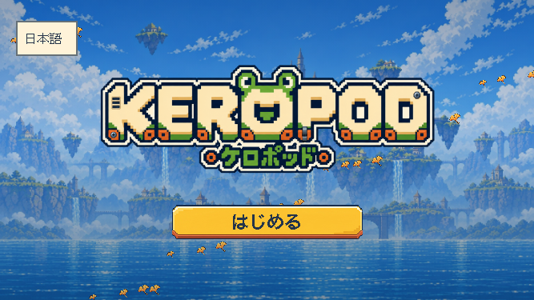

### ロビー

Desktop

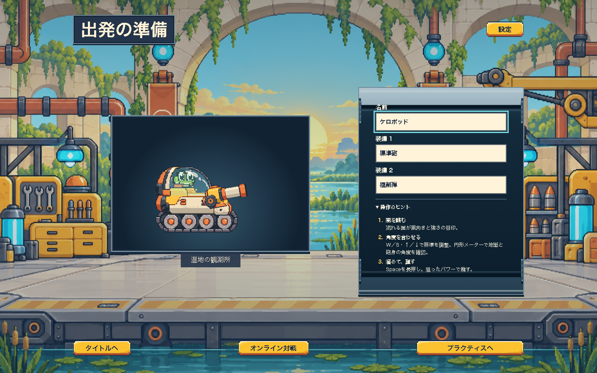

Mobile（ブラウザ模擬）

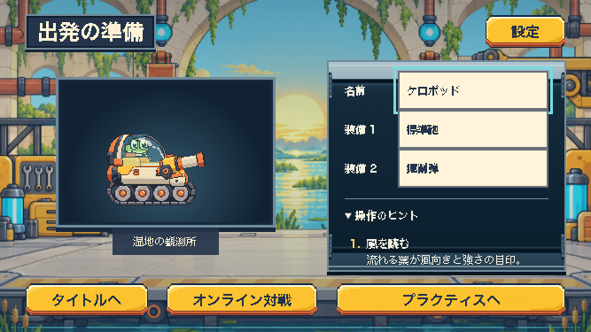

### 設定

Desktop

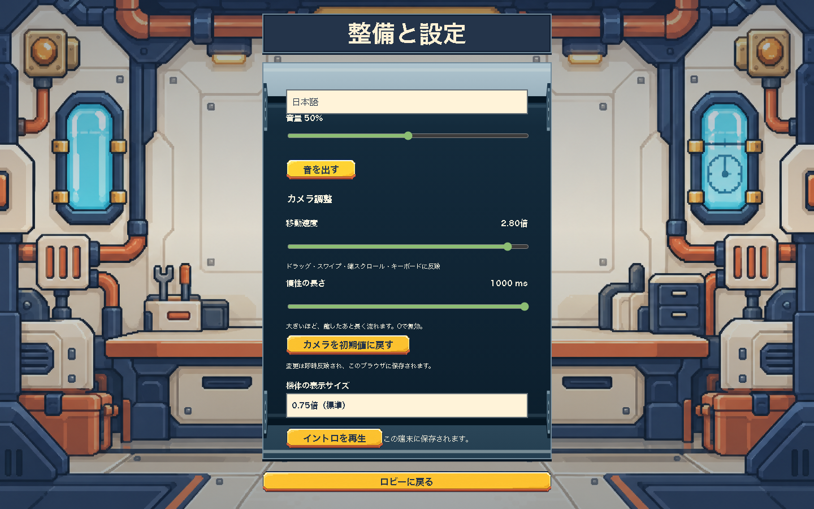

Mobile（ブラウザ模擬）

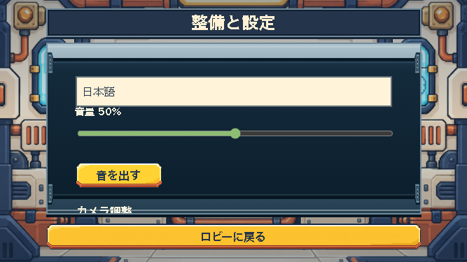

### 対戦

Desktop

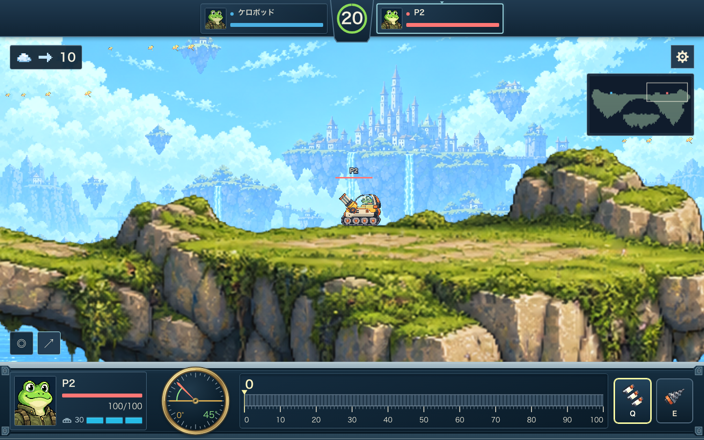

Mobile（ブラウザ模擬）

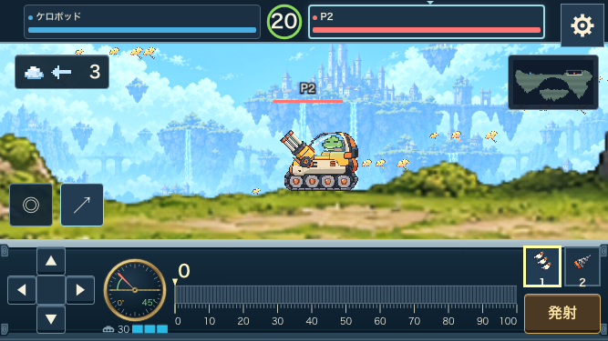

### リザルト

Desktop

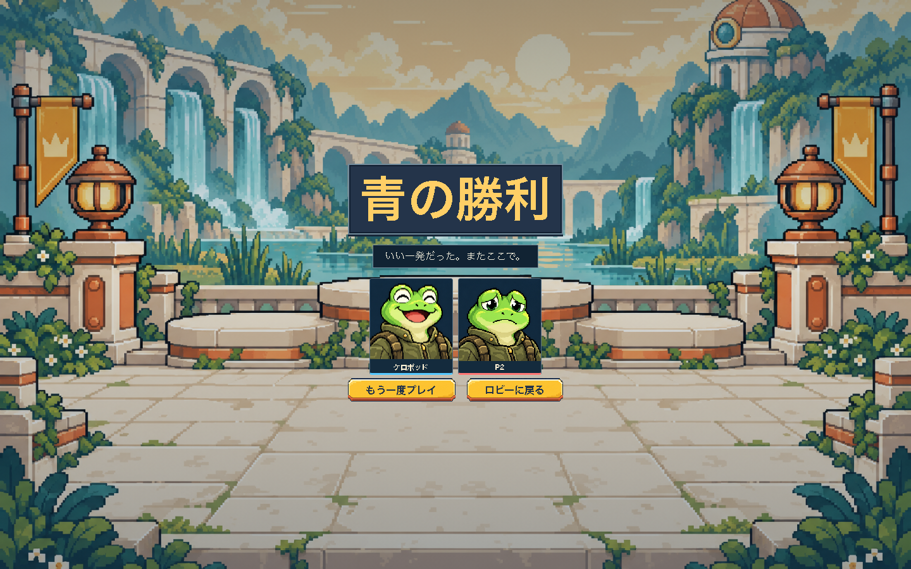

Mobile（ブラウザ模擬）

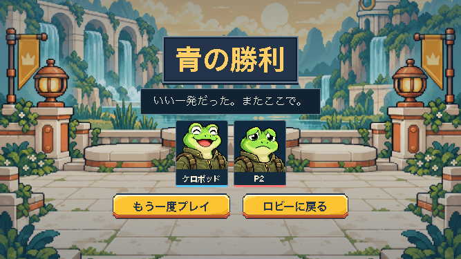

## 開始演出と地形破壊

マップ紹介中の画面。静止画なので、カメラの移動曲線や演出の時間は再現しない。

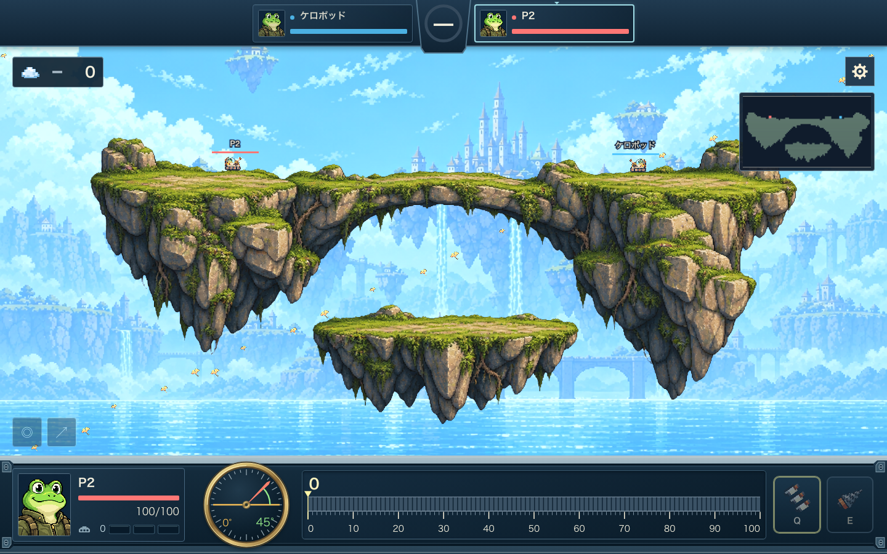

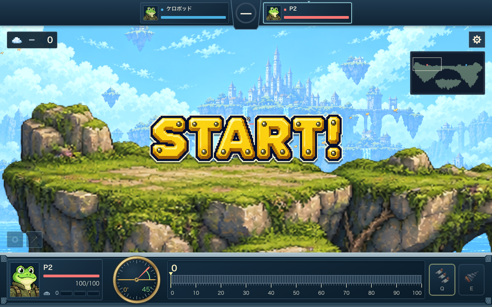

実射撃の前後。射撃後はTabでカメラ対象を切り替えているため、位置合わせした比較画像ではない。衝突セルの減少は自動テストで確認した。

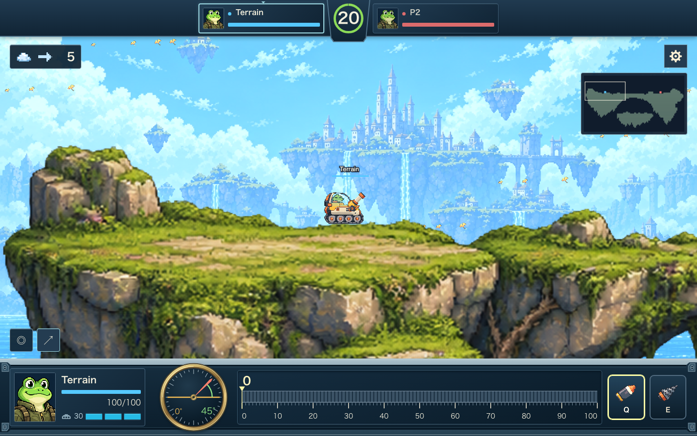

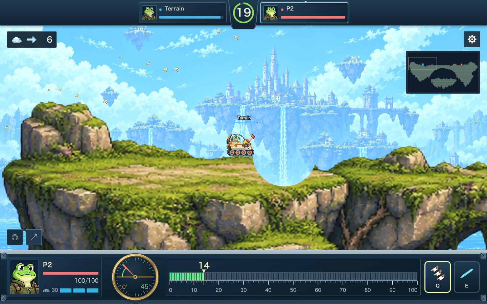

## 到達していた機能

| 分野 | 実装した内容 |
| --- | --- |
| 対戦 | 最大8人・自由なチーム編成、リアルタイム移動、招待、クイック参加、観戦、再接続、結果表示 |
| 操作 | WASD/矢印、Space射撃、Q/E武器切替、Tabでカメラ対象切替、タッチ十字キー |
| カメラ | 可変マップ、速度2.8倍・慣性1000ms、滑らかな開始終了、手番追従、開始時の紹介 |
| HUD | 100段階パワーメーター、円形角度計、移動残量、チーム色 |
| 描画 | 生成画像の背景と地形、破壊mask、落下、弾・爆発素材、風の表現 |
| 全体 | タイトル・ロビー・設定・対戦・リザルト、シーン演出、BGM・効果音 |

## 検証と限界

今回、既存の3ファイルを実行し **5件成功（52.8秒）**。タイトルから結果とロビー帰還、設定保持、PC/タッチの移動残量、開始中の入力抑止、射撃による地形破壊を確認した。

```sh
pnpm --filter @game/e2e exec playwright test scene-journey.spec.ts refinement.spec.ts image-terrain.spec.ts --config=production.config.ts --project=chromium
```

過去の[オンライン統合検証](../cockpit-online-2026-09-12.md)では、ローカルWranglerで8人・4v4を3ブラウザで確認した。終了は降参を使用しており、自然射撃のみの決着を証明するものではない。今回の5件は全テストの再実行ではない。

実機性能、世界各地域からの通信、Cloudflare本番容量と費用は未検証。UIの最終採用にも到達していない。本番公開・main統合は行っていない。

## 再現と保存場所

- 当時の実装全体: 上記Git commit。現在の記録文書は後続commitで保存。
- 比較に使用した[承認済みHUD原案](../../design/references/battle-hud-approved.png)。現在の画面と同一ではない。
- 生成グラフィック: `assets/runtime/world-v1/`、`assets/runtime/tanks-v1/`、`assets/runtime/maps/`。
- 統合済み音源: `apps/client/src/assets/audio/`（Gitで保存済み）。
- 音源の制作・統合経緯と追加の検証記録: [最終監査記録](../final-audit-2026-09-10.md)。音源は今回削除・置換していない。
- 次の方針: [シンプルなドットテーマへの変更](../../design/36-simple-dot-theme.md)。

作業環境を再現する際はこのcommitを独立checkoutに展開し、依存関係を導入して上のコマンドを実行する。ブラウザの版、乱数、時刻により次回の画面は完全一致しない。このPNGを発表時の固定記録とする。
