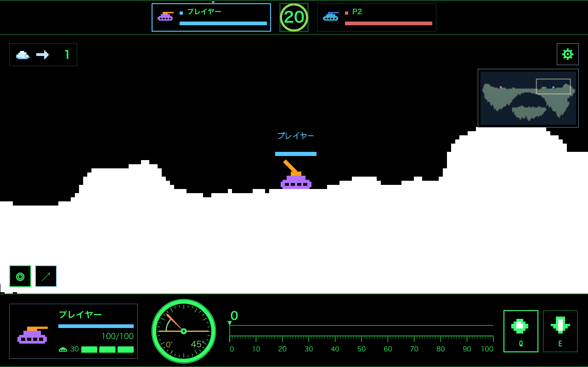
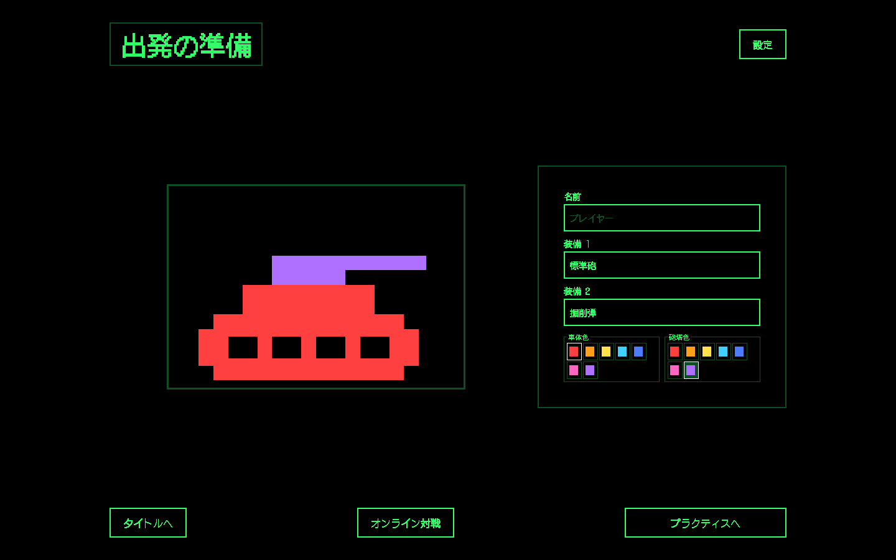
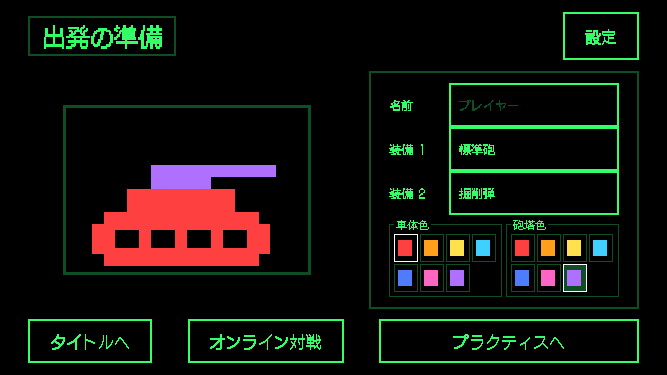
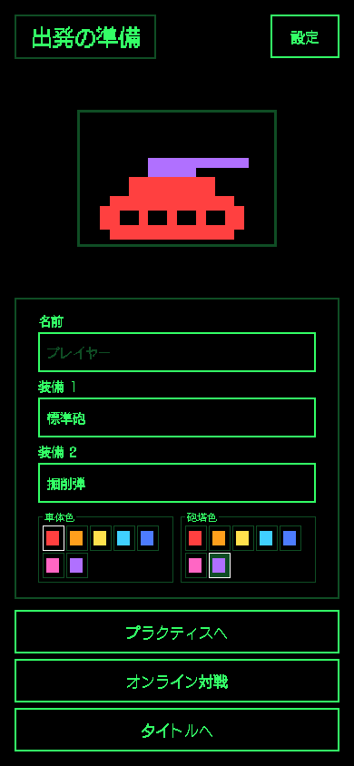

# タンク・武器のドット絵と移動操作の改善

待機画面で採用したタンクの形状を共通データ化し、ゲーム内とHUDへ反映した。車体色と砲塔色の選択を復活させ、ローカル保存、オンライン対戦の相手への配信、再接続後の復元まで対応した。チーム識別色は名前・HP・HUDで引き続き表示する。

移動した距離に応じて履帯のドットが循環し、実際に移動した時だけ短い走行音が鳴る。音量とミュートは既存設定に従う。全8武器のアイコンと弾を、武器ごとに異なるドット絵で描画する。待機画面の操作ヒントは撤去した。

落下中は入力の所有状態を保ったまま移動を一時停止し、着地後に押しっぱなしのキーで継続する。シミュレーション側の「落下したらその手番の移動を禁止する」制約も撤去した。移動量・レート制限と場外落下の処理は維持する。ルール変更に伴い、sim/rules識別子をv2.2へ更新したため、オンラインでは同じ版のclient/serverを使用する。

## 検証

- 全パッケージのtypecheck成功。
- 全unit test成功（725 passed / 4 skipped）。
- Chromium・Firefox・WebKitの関連ブラウザテスト33件成功。
- オンラインの色共有・射撃・地形同期・再接続テスト3件成功。
- 最終描画変更後、Chromiumで待機画面3サイズとゲーム内の落下後キー継続を再検証（4件成功）。
- キー継続テストはクライアントに決定的な段差を設置して確認したもの。サーバー側の落下後移動受理と残り移動量は、別のengine回帰テストで確認した。
- 走行音の発音間隔とミュート、履帯の循環・描画範囲、8武器の異なる形状をunit testで確認。

## キャプチャ

本番デプロイは行っていない。
